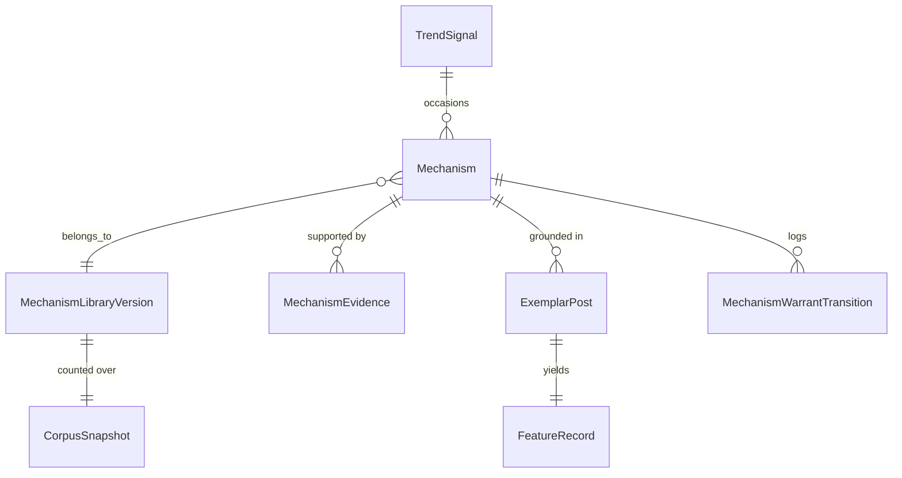

# Tech Spec Addendum: Knowledge Layer

**Extends:** [tech-spec-ugc-intelligence.md](tech-spec-ugc-intelligence.md)
**Decided by:** [ADR-0006](adr/0006-mechanisms-and-the-warrant-ladder.md) · [ADR-0007](adr/0007-the-knowledge-api-boundary.md)
**Components:** [component-1-pattern-engine.md](component-1-pattern-engine.md) §1.9–1.10 (produces) · [component-4-knowledge-api.md](component-4-knowledge-api.md) (serves)
**Schema:** [`schemas/mechanisms-v1.json`](schemas/mechanisms-v1.json)

---

## What this layer is for

The system's compounding asset is not the scorer. It is the answer to *why* a thing worked, stated so precisely that it can be shown to be wrong, and reachable by a machine at the moment a brief is being written.

This layer produces that answer and serves it. It does not produce a number, and the reason is structural rather than modest: the only corpus that transfers across tenants is the public exemplar corpus, whose engagement signal is `Proxy` on every platform that matters, and [ADR-0001](adr/0001-trend-signal-sourcing.md) forbids a `Proxy` value from entering an effect-size calculation.

So the knowledge layer trades the number for the reason, and says so on every response.

---

## Requirement deltas

**REQ-060** [Must] The system maintains a `Mechanism` entity: a falsifiable hypothesis about why a content structure recurs among high performers, keyed by `(vertical, platform)` with **no tenant axis**, mined exclusively from the public exemplar corpus and from trend signals.

**REQ-061** [Must] No `OutcomeEvent`, `Pattern`, `PerformanceSnapshot`, or ClientHub operational table is an input to mechanism synthesis, at any weight, under any configuration. The mechanism library is tenant-neutral by construction, not by a scoping check.

**REQ-062** [Must] A `Mechanism` carries no `effect_size`, `effect_ci`, `lift`, `vps`, `aws`, or any field expressing a magnitude of outcome. The schema sets `additionalProperties: false` and omits these keys, so introducing one fails validation rather than shipping a laundered number.

**REQ-063** [Must] Every `Mechanism` carries a `falsifier` — the observation that would sink it — recorded before its evidence is gathered. A mechanism without a stated falsifier is not persisted.

**REQ-064** [Must] Every `Mechanism` carries a `warrant ∈ {conjectured, recurrent, contrasted, falsified, retired}`, computed deterministically from corpus counts. `recurrent` requires `n_creators ≥ 8 ∧ n_cohorts ≥ 2 ∧ n_trends ≥ 2`. `contrasted` additionally requires `prevalence_ratio ≥ 2.0` on the mining slice and `≥ 1.5` on a temporally disjoint slice.

**REQ-065** [Must] Warrant demotion is automatic and immediate; promotion requires a named human to ratify the mechanism's `statement`. A `contrasted` mechanism whose asymmetry does not survive a corpus refresh is demoted to `falsified` and withdrawn from Component 4 in the same cycle, with no human step. `ratified_by`, `ratified_at`, and a non-empty `ratification_note` are required before any rung is served, and ratification volume and median latency per cohort are reported to the operator as the rubber-stamp decay signal — the ratifier's equivalent of REQ-021's override-rate-by-cohort.

**REQ-065a** [Must] A `contrasted` mechanism carries at least two ordered, non-overlapping `temporal_slices` (`slice[i].to ≤ slice[i+1].from`). The two-slice minimum is enforced by schema (`allOf`/`if`/`then` on `warrant`); disjointness is a cross-item comparison JSON Schema cannot express and is enforced by the synthesiser and re-checked at ratification.

**REQ-065b** [Must] The exemplar corpus builder retains **two** sets per cohort: each creator's top-decile posts, and the same creators' posts below their own top decile. Both are extracted to `FeatureRecord`s under the same `extractor_version`. The second set is the contrast set, and without it `prevalence_in_contrast_set` is uncomputable and no mechanism can leave `conjectured`.

**REQ-065c** [Must] Every `Mechanism` carries `ingestion_arm ∈ {trend_directed, uniform, mixed}`, propagated from the exemplars that ground it. This is the stratifier for REQ-005f's coupling gate. **It is not the amplification `arm`**, which is `{exploit, explore}`, lives on `AmplificationAllocated` and `PerformanceSnapshot`, governs client money under ADR-0003, and never appears on a `Mechanism`. The two field names must never converge.

**REQ-066** [Must] No `Mechanism`, and nothing derived from one, is an input to a veto (V1–V6), a verdict, a VPS, a BAS, an AWS term, or a budget allocation. Component 2 has no code path to a mechanism.

**REQ-067** [Must] Every Component 4 response carries `warrant`, `provenance.label`, `never_tested_against`, `falsifier`, `mechanism_library_version`, and `sha256`. No response carries a `0-100` field or an effect size.

**REQ-068** [Must] A Component 4 collection response distinguishes `served`, `below_warrant_bar`, `no_library`, and `corpus_stale`, and names the blocking counts where a cohort is below the bar. An empty response never presents as an absence of structure.

**REQ-069** [Must] `GET /api/knowledge/mechanisms/{id}/exemplars` returns public post URIs and predicate-satisfaction booleans only. It never returns frames, transcripts, faces, or any extracted personal information. See [compliance-notes.md](compliance-notes.md).

**REQ-070** [Should] A quarterly "what changed" report per vertical is *derived by reading Component 4* — mechanisms promoted, mechanisms falsified, coverage gaps — rather than assembled independently. This supersedes REQ-007's standalone framing.

---

## Data model



Note what does **not** appear on this diagram: `Tenant`, `Submission`, `LivePost`, `PerformanceSnapshot`, `Pattern`, `OutcomeEvent`. Their absence is the design.

```
Mechanism
  id                        uuid
  mechanism_library_version string     -- "beauty.tiktok.m3". NO tenant_id column exists.
  vertical                  string
  platform                  enum
  statement                 text       -- the WHY, in prose. Model-DRAFTED, human-RATIFIED,
                                       -- never machine-consumed. UNTRUSTED as an input.
  feature_predicate         jsonb      -- machine-evaluable over FeatureRecord. The only
                                       -- machine-readable part of a mechanism.
  falsifier                 text       -- REQUIRED. Written before evidence is gathered.
  warrant                   enum(conjectured, recurrent, contrasted, falsified, retired)
  ingestion_arm             enum(trend_directed, uniform, mixed)
                                       -- stratifier for the REQ-005f coupling gate.
                                       -- NOT the amplification arm(exploit|explore), which
                                       -- governs client money and never appears here.
  occasioned_by_trend_ids   uuid[]     -- archived trends stay queryable
  ratified_by               uuid       -- REQUIRED before serving. A real human.
  ratified_at               timestamptz
  ratification_note         text       -- REQUIRED, non-empty. Why it was accepted, in the
                                       -- ratifier's words. Symmetric with the breaker's
                                       -- "manual, with a recorded reason, to arm".
  superseded_by             uuid null
  valid_from                date
  valid_to                  date

MechanismEvidence
  mechanism_id              uuid
  n_exemplars               int
  n_creators                int        -- INDEPENDENT creators. Ten posts by one creator
                                       -- is one creator, not ten data points.
  n_cohorts                 int
  n_trends                  int        -- unrelated trends. >= 2 for `recurrent`.
  prevalence_in_top_decile  numeric    -- [0,1]
  prevalence_in_contrast_set numeric   -- [0,1]
  prevalence_ratio          numeric
  contrast_set_definition   text       -- REQUIRED. A prevalence without a comparison
                                       -- group is a number with no meaning.
  slice_from                date
  slice_to                  date
  corpus_snapshot_sha256    text       -- what makes a falsification reproducible
  provenance_corpus_selection    const 'Proxy'
  provenance_predicate_evaluation const 'Measured'

MechanismWarrantTransition
  mechanism_id              uuid
  from_warrant              enum
  to_warrant                enum
  transitioned_at           timestamptz
  caused_by_snapshot_sha256 text
  actor                     enum(automatic_demotion, human_ratification)
  actor_id                  uuid null  -- non-null iff actor = human_ratification
```

There is no `effect_size` column, and there is no nullable one waiting to be filled. A number that exists gets copied into a slide, and the provenance label does not travel with it. [ADR-0001](adr/0001-trend-signal-sourcing.md) chose structural provenance over documentary provenance for exactly this reason.

---

## The maths, such as it is

**Prevalence.** For a predicate `P` in a cohort, over a temporal slice of the exemplar corpus:

```
prevalence_in_top_decile   = |{ e ∈ TopDecile      : P(e.feature_record) }| / |TopDecile|
prevalence_in_contrast_set = |{ e ∈ ContrastSet    : P(e.feature_record) }| / |ContrastSet|
prevalence_ratio           = prevalence_in_top_decile / prevalence_in_contrast_set
```

**The contrast set, v1:** *the same creators' posts that did not reach their own top decile* — **extracted and retained** alongside the top-decile corpus (C1 §1.5, REQ-065b), not discarded as the source recipe does. Same creators controls for audience size. Same platform controls for format norms.

**Nothing controls for the content nobody ever made.** Both halves come from creators already selected for consistent high performance, so the contrast set is *a winner's ordinary work*, not *a loser's work*. That is the survivorship bias the exemplar corpus carries irreducibly, which every mechanism declares in `never_tested_against`, and which no public corpus will ever fix.

**Cohort scope.** Prevalences are computed strictly **within this library's own cohort** — `beauty.tiktok.m3` counts over beauty-on-TikTok exemplars and nothing else. They are never pooled across cohorts, because two `(vertical, platform)` populations are not one population. `n_cohorts` is a **recurrence count** — how many other cohorts' libraries independently carry the predicate — not an instruction to pool.

**Why this is a count and not a lift, and is therefore permitted.** `TopDecile` membership was decided using keyless public engagement — `Proxy`, always, per ADR-0001 Tier 3. But `P` is evaluated *deterministically* over the `FeatureRecord` extracted from the media itself. A prevalence is a **count over a proxy-selected set**, not an aggregation of proxy *values*. No `Proxy` number is displayed, averaged, or compared as `Measured` at any point. This is what the provenance label `Proxy-selected, Measured-evaluated` records, and it is the whole of the argument.

`prevalence_ratio` is a **descriptive asymmetry on a proxy-selected sample.** It is confounded by every variable the corpus did not observe. It is not a risk ratio in any causal sense, and the words *causes*, *lifts*, *drives*, and *predicts* are unavailable at every rung.

**The obvious objection, answered.** ADR-0006 refuses a `Proxy`-labelled `effect_size` on the grounds that *"a number that exists gets copied into a slide, and the label does not come with it."* `prevalence_ratio` is also a number, and `2.45` reads like a 2.45× multiplier once detached from its wrapper. Why is one refused and the other served?

Because they fail differently. An `effect_size` mined over Proxy engagement aggregates a **Proxy value into a magnitude** — ADR-0001's hard invariant, breached at the point of computation, before anyone copies anything anywhere. A `prevalence_ratio` is the quotient of two deterministic **counts** over a proxy-*selected* set; no Proxy value is aggregated, displayed, or compared as `Measured`, so the invariant holds no matter where the number travels.

What remains is **misreading, not laundering**, and it is mitigated rather than eliminated: the field is never named `lift` or `effect_size`; `warrant`, `never_tested_against`, and the provenance label ride on every response; the forbidden-verb lexicon bars causal language. **The residual risk is accepted and named**, because a mechanism carrying no quantity at all could not be falsified, and falsifiability is the entire point of the object.

**No significance test, deliberately.** There is no sampling model that honestly describes "the top decile of a hand-curated allowlist of creators, ranked on proxy engagement." A confidence interval would import a precision the sampling frame cannot support.

**And the thresholds are guesses.** `2.0` on the mining slice and `1.5` on the disjoint slice are not derived from anything; with `n_creators` as low as 8 and no significance test, a 1.5× asymmetry sits close enough to 1.0 to be noise. They are guesses wearing precision, exactly like the `authenticity_register` weight of 0.06 that the eval plan openly flags. The honest mitigation is the recalibration rule, not a better-sounding number: **if a majority of proposed predicates reach `contrasted` in the first year, the bar is too low and the corpus is too small, in that order.**

**Independence.** `n_creators` counts distinct creators, not posts. Ten posts by one creator is one creator. A predicate that recurs across eleven posts by two creators has `n_creators = 2` and does not reach `recurrent`. This is the guard against a corpus of winners being a corpus of one winner's habits.

**Temporal disjointness.** `contrasted` requires the asymmetry to hold on a slice the predicate was *not* mined from. Mined on Q1, checked on Q2. A pattern that holds only in the window it was mined from is a description of that window — the same rule the pattern miner already obeys, applied to a different object.

**No significance test, deliberately.** There is no p-value here and no confidence interval, because there is no sampling model that honestly describes "the top decile of a hand-curated allowlist of creators, ranked on proxy engagement." Reporting a CI would import a false precision that the sampling frame cannot support. Two prevalences, their ratio, the counts they were computed from, and the snapshot they were counted over — that is the whole evidence, and it is stated in full rather than compressed into a statistic that implies a design it never had.

---

## The warrant ladder

| Rung | Requires | You may say | Served |
|---|---|---|---|
| `conjectured` | a predicate proposed from the corpus or a trend | "a shape somebody noticed" | no |
| `recurrent` | `n_creators ≥ 8` ∧ `n_cohorts ≥ 2` ∧ `n_trends ≥ 2` | "recurs among high performers across unrelated trends" | yes |
| `contrasted` | recurrent ∧ ratio ≥ 2.0 (mining slice) ∧ ratio ≥ 1.5 (disjoint slice) | "…and is materially absent from the same creators' non-performers" | yes |
| `falsified` | the asymmetry did not survive a refresh | nothing | no; retained forever |
| ~~`deconfounded_within_tenant`~~ | explore-arm internal outcome data | — | **out of scope by design** |
| ~~`interventional`~~ | explore allocations stratified on the predicate | — | **out of scope by design** |

`n_trends ≥ 2` is where [ADR-0004](adr/0004-trend-detection-and-submission.md)'s *"trends are disposable, mechanisms compound"* becomes a computation. A predicate observed only inside one trend's posts *is that trend*, wearing a lab coat.

The refused rungs are named, not omitted. **A ladder whose top is invisible gets climbed by accident.** `deconfounded_within_tenant` would require a tenant's outcomes to inform a tenant-neutral artefact — that object exists, it is a `Pattern`, and it stays inside its tenant. `interventional` would require stratifying the explore budget on a predicate rather than on rank-uncertainty, trading away the Thompson objective [ADR-0003](adr/0003-exploration-budget.md) chose, for power it would not have at hundreds of posts per year.

**`contrasted` is the top of this ladder and it is not a causal claim.**

---

## Cadence and failure modes

| Cadence | What |
|---|---|
| Quarterly, on exemplar corpus refresh | Recount prevalences on the new slice, over both the top-decile corpus and the contrast set. Auto-demote any `contrasted` mechanism whose asymmetry vanished. Cut and publish a new `MechanismLibraryVersion`. |
| On corpus refresh | Recompute `n_trends` as trends archive and new ones are occasioned. A mechanism does not lose a trend when that trend dies. |
| Ad hoc | Human ratification of drafted statements, with a recorded reason. Never on a timer. |
| Continuously, to the operator | Ratification volume and median latency per cohort — the rubber-stamp decay signal. |

| Failure | Behaviour |
|---|---|
| Exemplar corpus empty for a platform (no compliant source, per ADR-0001) | No mechanisms for that cohort. `coverage.state = "no_library"`. Stated as a coverage gap, never as an absence of structure. |
| Fewer than 8 independent creators carry a predicate | Stays `conjectured`. Never served. There is no deadline by which a mechanism must be promoted. |
| Predicate appears in only one trend | Stays `conjectured`, regardless of how many creators carry it. It is a trend, not a mechanism. |
| `prevalence_in_contrast_set = 0` | `prevalence_ratio` is undefined, not infinite. The mechanism stays `conjectured` and the zero is surfaced. A predicate absent from every non-winner is more likely a corpus artefact than a discovery. |
| Asymmetry vanishes on refresh | Auto-demote to `falsified`, withdraw from C4 the same cycle, log the transition with the causing snapshot hash. No human step. |
| Corpus not refreshed in 30 days | `coverage.state = "corpus_stale"`. Mechanisms still served, staleness surfaced. A decaying library that nobody notices is the quiet failure mode of every system of this kind. |
| Model drafts a statement asserting a causal claim | Rejected at ratification. The reviewer's checklist forbids *causes*, *lifts*, *drives*, *predicts*. Logged. |
| Prompt injection in an exemplar caption reaching the statement drafter | Fenced as untrusted, identically to a creator caption per ADR-0002. Never machine-consumed downstream. Human ratification is the control that survives a determined attempt, which is why it is a required field rather than a workflow step. |
| Source post deleted after the corpus snapshot | The URI dies; the counts survive, because they were computed at `corpus_snapshot_sha256` and the artefact is immutable. `/exemplars` returns the dead URI marked `unresolvable`. |

---

## Cost

Negligible, and worth stating because it is the argument against deferring this layer.

Mechanism synthesis is a counting job over `FeatureRecord`s that already exist — the exemplar corpus is extracted regardless, for pattern proposal and retrieval anchoring. The only new model spend is drafting `statement` prose for candidates that reach `recurrent`, which at eight-creator/two-cohort/two-trend thresholds will be a handful per cohort per quarter. Human ratification is the real cost, and it is measured in minutes per mechanism, quarterly.

Component 4 serves immutable, content-addressed artefacts and is cacheable to the edge indefinitely. It is the cheapest component in the system, and per [ADR-0007](adr/0007-the-knowledge-api-boundary.md) its smallness is precisely why it stays separate rather than being folded into C1.
