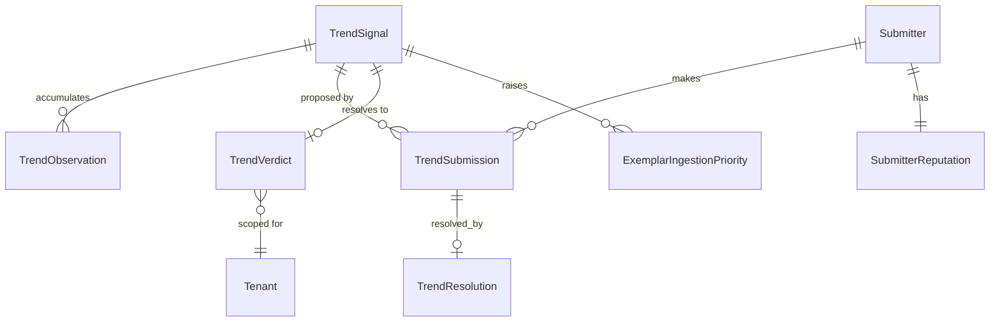

# Tech Spec Addendum: Trend Subsystem

**Extends:** [tech-spec-ugc-intelligence.md](tech-spec-ugc-intelligence.md)
**Decided by:** [ADR-0004](adr/0004-trend-detection-and-submission.md)
**Replaces:** PRD REQ-005
**Amended by:** [ADR-0006](adr/0006-mechanisms-and-the-warrant-ladder.md) — REQ-005f's coupling is now measurable, and trend archival now has a downstream consumer

> **Requirement-ID correction.** An earlier draft of this document numbered its trend-archival rule `REQ-006`, colliding with the PRD's `REQ-006` (pattern staleness). Two different requirements shared one ID. The trend rule is renumbered **REQ-005h**, joining the `REQ-005*` family it belongs to. PRD `REQ-006` keeps its original meaning and is unchanged.

---

## Requirement deltas

**REQ-005** [Must] The system runs a scheduled scan across the configured keyless sources, computing a robust z-score for each tracked term against its own trailing 28-day baseline, and raises a `TrendCandidate` where `z > 3` is sustained across two or more consecutive daily observations. Single-day spikes do not raise candidates.

**REQ-005a** [Must] Any authenticated user with a manager, client, or resolver role can submit a candidate trend, supplying platform, vertical, evidence URIs, a predicted lifecycle stage at T+14d as a probability distribution over `{rising, peak, declining}`, and a free-text rationale. A submitter may hold at most `max_open_positions` (default 5) unresolved submissions concurrently.

**REQ-005b** [Must] Every submission resolves at T+14d and again at T+30d. Where an automated source observes the trend, the detector resolves it. Where no automated source exists, a named resolver records the outcome with evidence, provenance `User-provided`. A submitter may never resolve their own submission; such a resolution is void and is logged.

**REQ-005c** [Must] Each resolution produces a ranked probability score for the submitter's prediction over the ordered classes, and a lead-time credit computed as `skill_score × log(1 + lead_days)` where `lead_days = max(0, corroboration_date − submission_date)`. Submitter reputation is a shrunk estimate over resolved credits and is applied as a weight when promoting candidates to actionable.

**REQ-005d** [Must] Every trend surfaced to a user carries a lifecycle stage, a `days_remaining` band, a brand-fit score, a risk flag, and a `go | caution | skip` verdict computed against the tenant's configured brief-to-live lead time. Until at least 20 trends have resolved for a platform, `days_remaining` is reported as a band and never as a numeric estimate.

**REQ-005e** [Must] No `TrendSignal` value enters VPS computation, at any weight, under any configuration. Trend adherence may enter BAS only as a deterministic check against a format explicitly named in the stored brief.

**REQ-005f** [Should] A `rising` trend with a `go` verdict raises the exemplar ingestion priority for its format and vertical, so the Pattern Engine mines the mechanism underneath the format. **This coupling is a claim, not an assumption:** per the [eval plan](eval-and-calibration-plan.md), mechanisms mined from trend-directed ingestion must reach `contrasted` at a materially higher rate than those from uniform ingestion. If they do not, the priority is set uniform and REQ-005f is deleted.

**REQ-005g** [Should] The trend feed is visible to manager, client, and resolver roles. It is not visible to creator roles.

**REQ-005h** [Must] *(renumbered from REQ-006; see the ID correction above)* A `TrendSignal` with no observation refresh inside its `valid_to` window is auto-archived and ceases to appear in any feed. Archived signals remain queryable for resolution, for decay-curve fitting, and for the `Mechanism.occasioned_by_trend_ids` and `n_trends` computations in [tech-spec-knowledge-layer.md](tech-spec-knowledge-layer.md) — **a mechanism does not lose a trend when that trend dies.** That is what "mechanisms compound" means arithmetically.

**REQ-005i** [Must] No `TrendSignal` value enters a `Mechanism`'s `warrant` computation. A trend decides *where the corpus builder looks*; it never decides whether a mechanism is real. The one place a trend appears in mechanism evidence is `n_trends` — a count of how many **unrelated** trends a predicate survived, which is the opposite of a trend influencing a warrant, and is the guard against a mechanism being a single trend wearing a lab coat.

---

## Data model



```
TrendSignal
  id                  uuid
  scope               enum(public, internal)     -- internal signals are tenant-scoped, public are not
  tenant_id           uuid null                  -- non-null iff scope = internal
  platform            enum
  vertical            string
  kind                enum(format, sound, hashtag, topic, aesthetic)
  label               text
  first_seen_at       timestamptz
  origin              enum(detector, submission)
  lifecycle_stage     enum(candidate, rising, peak, declining, archived)
  confidence          enum(single_source, corroborated, human_corroborated)
  valid_to            date
  archived_at         timestamptz null

TrendObservation
  id                  uuid
  signal_id           uuid
  source              enum(google_trends_rss, reddit, youtube_rss, wikipedia_pageviews,
                           hacker_news, news_pulse, tiktok_creative_center_manual, human)
  observed_at         date
  volume              numeric
  robust_z            numeric
  provenance          enum(Measured, User-provided, Estimated, Proxy)   -- keyless sources are always Proxy
  as_of               timestamptz

TrendSubmission
  id                  uuid
  submitter_id        uuid
  signal_id           uuid null                  -- null until matched or created
  platform            enum
  vertical            string
  kind                enum
  label               text
  evidence_uris       text[]                     -- UNTRUSTED
  rationale           text                       -- UNTRUSTED
  predicted_stage_t14 jsonb                      -- {rising: p, peak: p, declining: p}, sums to 1
  submitted_at        timestamptz
  status              enum(open, resolved, void)
  void_reason         text null

TrendResolution
  id                     uuid
  submission_id          uuid
  horizon                enum(t14, t30)
  actual_stage           enum(rising, peak, declining)
  resolved_at            timestamptz
  resolver_kind          enum(detector, human)
  resolver_id            uuid null               -- must never equal submission.submitter_id
  evidence_uri           text null               -- required when resolver_kind = human
  corroboration_date     date null               -- when an independent source first confirmed
  lead_days              int
  rps                    numeric                 -- ranked probability score, lower is better
  skill_score            numeric                 -- 1 - normalised RPS, clamped [0,1]
  credit                 numeric                 -- skill_score * ln(1 + lead_days)
  disputed               bool
  provenance             enum(Measured, User-provided)

SubmitterReputation
  submitter_id           uuid
  n_resolved             int
  mean_skill             numeric
  mean_lead_days         numeric
  shrunk_weight          numeric   -- (n/(n+k)) * observed + (k/(n+k)) * prior; k = 20
  total_credit           numeric
  open_positions         int
  max_open_positions     int       -- default 5
  last_updated           date

TrendVerdict
  id                     uuid
  signal_id              uuid
  tenant_id              uuid              -- verdict is per-tenant; brand fit and lead time differ
  lifecycle_stage        enum
  days_remaining_band    enum(short, medium, long, unknown)
  days_remaining_est     int null          -- null until >= 20 resolved trends on this platform
  brand_fit              numeric           -- 0-100
  risk_flag              enum(none, caution, blocked)
  verdict                enum(go, caution, skip)
  computed_at            timestamptz
  valid_to               date
```

`TrendSignal.scope` is the field that keeps ADR-0001's multi-tenant boundary intact. A trend observed on the public web is public information and is shared across tenants. A trend inferred from a tenant's own campaign outcomes is not, and never crosses. `TrendVerdict` is always tenant-scoped, because brand fit and brief-to-live lead time are properties of the tenant, not of the trend.

`evidence_uris` and `rationale` are untrusted. They are fenced identically to creator captions per ADR-0002 whenever they enter a model prompt, and they never enter a verdict computation.

---

## Detection maths

**Baseline.** Per `(term, source)`, maintain a trailing 28-day window of daily volume. Compute median and median absolute deviation. Mean and standard deviation are wrong here for the same reason they are wrong in `CreatorBaseline`: volume series are heavy-tailed and one news event drags a mean baseline high enough to mask a real emerging trend for a month.

```
robust_z = 0.6745 · (x_today − median_28d) / MAD_28d
```

**Candidate rule.** `robust_z > 3` on two or more consecutive days. The consecutive-day requirement is what separates a trend from a news event, and it costs one day of latency to buy a large reduction in false positives. A single-day `z > 5` raises an alert to the manager but does not create a `TrendSignal`.

**Corroboration.** A candidate observed independently by a second source upgrades `confidence` from `single_source` to `corroborated`. It does not upgrade `provenance`, which remains `Proxy` for every keyless read. A human submission that predates automated corroboration upgrades `confidence` to `human_corroborated` and stamps `corroboration_date` on any submission that named it.

**Lifecycle.** Smooth the observation series with a 3-day EMA. Let `v` be the first difference and `a` the second.

| Stage | Condition |
|---|---|
| `rising` | `v > 0` and `a ≥ 0` |
| `peak` | `v ≈ 0` and `a < 0`, or `v > 0` with `a` strongly negative |
| `declining` | `v < 0` |

**Days remaining.** Fitted from the observed post-peak decay of resolved trends on the same platform. With fewer than 20 resolved trends on a platform, no curve is fitted, `days_remaining_est` is null, and `days_remaining_band` is derived from lifecycle stage alone: `rising → long`, `peak → short`, `declining → short`. Once a curve exists, bands derive from the fitted estimate and the numeric estimate is exposed with its interval.

**Verdict.**

```
lead_time := tenant.brief_to_live_days          -- typically 7-14

go       iff stage = rising
          ∧ days_remaining_band ∈ {medium, long}
          ∧ (days_remaining_est is null ∨ days_remaining_est > lead_time × 1.5)
          ∧ brand_fit ≥ θ_fit
          ∧ risk_flag = none

caution  iff stage = peak ∨ risk_flag = caution

skip     iff stage = declining
          ∨ risk_flag = blocked
          ∨ days_remaining_band = short
```

The `× 1.5` safety factor exists because brief-to-live is a median, not a guarantee, and the cost of landing a campaign into a dying trend is the whole campaign.

---

## Submitter scoring

**Ranked probability score** over ordered classes `rising ≺ peak ≺ declining`. For predicted cumulative distribution `P` and observed cumulative `O` across the three ordered outcomes:

```
RPS = (1 / (k − 1)) · Σᵢ₌₁^{k−1} (Pᵢ − Oᵢ)²          k = 3
skill_score = clamp(1 − RPS / RPS_baseline, 0, 1)
```

`RPS_baseline` is the score of a naive forecaster predicting the platform's historical base rate of each stage. A submitter who cannot beat the base rate scores zero skill, which is correct.

RPS rather than plain Brier because the classes are ordered: predicting `peak` when the truth is `rising` is a smaller error than predicting `declining`, and a multi-class Brier treats both as equally wrong.

**Credit.**

```
lead_days = max(0, corroboration_date − submitted_at)
credit    = skill_score × ln(1 + lead_days)
```

A correct call made after independent corroboration earns `ln(1) = 0`. This is the sandbagging guard, and it is structural rather than a policy. Accuracy on obvious trends buys nothing.

**Reputation.** Shrunk toward the prior so that early luck does not become authority.

```
shrunk_weight = (n / (n + k)) · observed_mean_credit
              + (k / (n + k)) · prior_credit          k = 20
```

At `n = 0` a submitter carries exactly the prior. At `n = 20` they carry half their observed record. Ten months of fortnightly submission gets a manager to `n = 20`, which is slow, and the promotion rule must therefore degrade gracefully: with weights near the prior, a human submission means "a person saw this, corroborate before acting," not "act."

**Promotion.** A candidate raised only by submission is promoted to `TrendSignal` when either the weighted sum of its submitters' `shrunk_weight` clears a threshold, or a second independent submitter names it, or the detector independently corroborates it. Automated candidates are promoted on the two-consecutive-day rule alone.

**Void conditions.** Self-resolution voids the resolution and logs it. A submission whose `evidence_uris` fail to resolve, or resolve to content that does not exist at the named platform, voids the submission. Voided submissions do not count toward `n_resolved` and do not free an open position for 14 days.

---

## API surface

```
GET    /api/trends?vertical=&platform=&verdict=go     → tenant-scoped verdicts, manager/client/resolver only
GET    /api/trends/{id}                               → signal, observations, verdict, submitters
POST   /api/trends/submissions                        → {platform, vertical, kind, label,
                                                          evidence_uris[], predicted_stage_t14, rationale}
GET    /api/trends/submissions/mine                   → open positions, resolved history, credits
POST   /api/trends/submissions/{id}/resolve           → resolver only; 403 if submitter_id = caller
GET    /api/trends/leaderboard                        → shrunk_weight, n_resolved, mean_lead_days

GET    /internal/trends/scan                          → scheduled; raises candidates
POST   /internal/trends/{id}/fit-decay                → refits days_remaining curve for a platform
```

---

## Cadence and surfacing

| Cadence | What |
|---|---|
| Daily, 06:00 AEST | Keyless scan across all configured sources. Candidates raised, lifecycles recomputed, verdicts refreshed. |
| Immediate | Alert to manager on `z > 4` with corroboration in a tracked vertical, or on any `go` verdict newly issued. |
| Weekly digest | Top rising with `go`, the watch list, the avoid list, open submissions awaiting resolution, submissions resolving this week. |
| T+14d, T+30d | Resolution sweep. Reputations updated. Decay curves refitted where a platform crosses 20 resolutions. |

The interface must state, per platform, whether coverage is automated or human-sourced, and how many submissions are currently open. A feed showing six Reddit trends and no TikTok trends, presented without comment, reads as a claim that nothing is happening on TikTok. That is the most likely way this component quietly misleads someone.

---

## Failure modes

| Failure | Behaviour |
|---|---|
| A source goes dark (RSS feed 404s, API shape changes) | Baselines for terms sourced only from it freeze. Signals depending on it drop to `single_source` confidence or archive at `valid_to`. Alert. Never impute a volume. |
| Fewer than 20 resolved trends on a platform | `days_remaining_est` stays null. Bands derive from lifecycle stage. No numeric estimate is ever surfaced. |
| Submitter attempts to resolve own submission | 403. Resolution voided. Logged against the submitter record. |
| Evidence URI is dead or points to nonexistent content | Submission voided. Position not freed for 14 days. |
| Prompt injection in `rationale` or `evidence_uris` | Fenced as untrusted per ADR-0002. Never enters verdict computation, which is deterministic. Logged. |
| Zero human submissions for a platform for 30 days | Surfaced as a coverage gap on the feed, not as an absence of trends. The distinction is the whole point. |
| A trend is called `go`, campaign ships, trend was already dead | Recorded as a verdict miss. Verdict accuracy is itself tracked and reported, per the eval plan's discipline that anything producing a number must be able to be shown wrong. |
