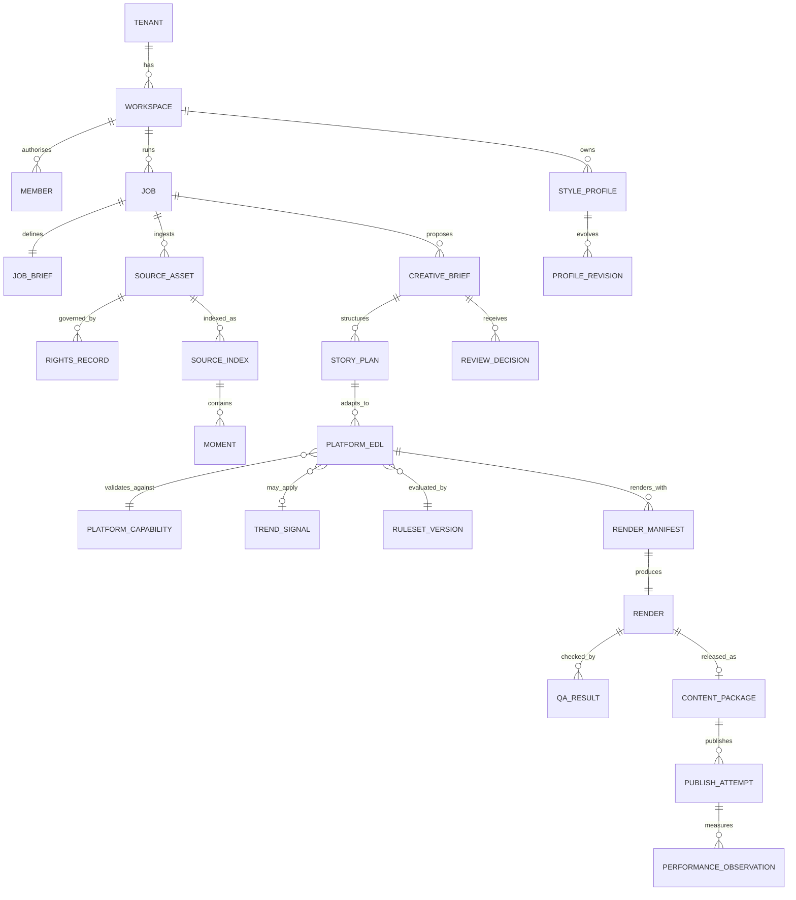
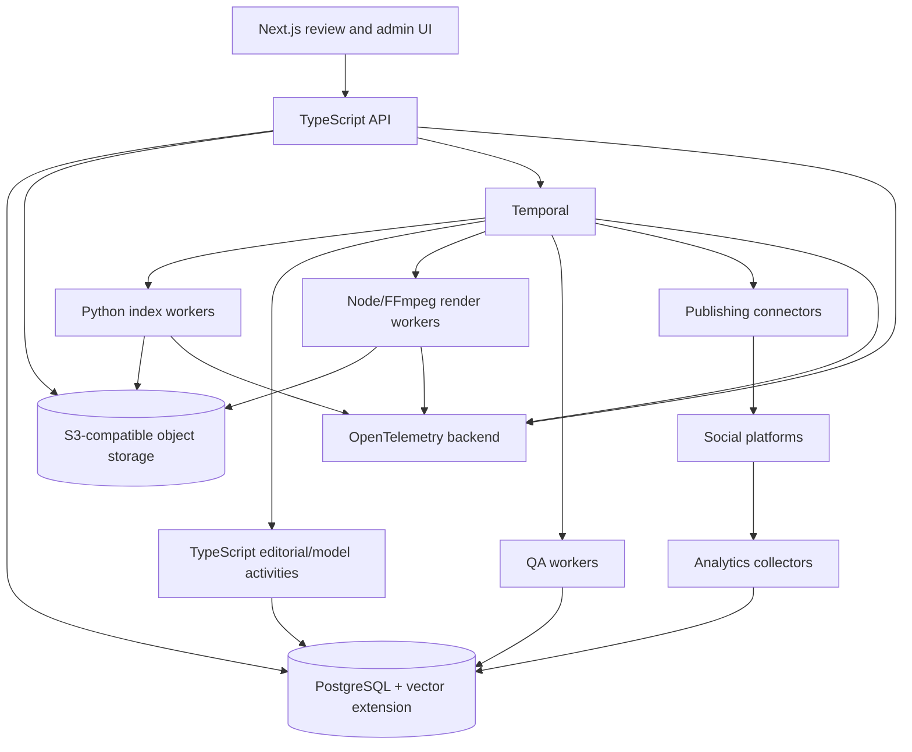

# PRD: Cutdown v2 — Performance-Informed AI Editorial Engine for Social Video

**Working title:** Cutdown  
**Status:** Research-informed draft  
**Date:** 20 July 2026  
**Primary user:** Social Soup production team, followed by agencies, brands, and creators  
**Initial delivery model:** Claude Code-assisted local product; hosted multi-tenant platform after editorial quality is proven  
**Product thesis:** Turn a set of real source videos into original, platform-native social content that is faster to approve, faithful to the account, technically compliant, rights-aware, and measurably more effective for a stated objective.

> **Product-language decision:** The product does not promise to “hack” or manipulate a social algorithm. It performs **policy-compliant distribution optimisation**: improving the probability that the right audience chooses, understands, watches, shares, saves, comments on, or acts on a piece of content. Artificial traffic, fake engagement, spam, deceptive engagement bait, and policy evasion are explicitly out of scope.

---

## 0. Executive Decisions

| Decision | v2 position | Why it matters |
|---|---|---|
| Primary optimisation target | Viewer value and the job objective, not a generic “viral score” | Platforms use multiple personalised signals, and the useful outcome differs for discovery, trust, conversion, and community content. |
| Core editorial contract | `CreativeBrief → MasterStoryPlan → PlatformEDL → RenderManifest` | Separates strategic intent, narrative structure, platform adaptation, and deterministic execution. |
| Cross-platform strategy | One master story plan may produce different child EDLs per platform | A crop or resize alone cannot account for different discovery surfaces, durations, UI safe zones, audio rights, metadata, or calls to action. |
| Editorial rules | Versioned hypotheses with scope, confidence, and evidence | “Hook before 1.5 seconds,” “payoff after 70%,” and fixed cut rates are useful experiments in some contexts, not universal laws. |
| Analytics | A first-class requirement from Phase 1 | Account-specific learning is the defensible advantage; without outcomes, the engine only reproduces generic editing folklore. |
| Originality and integrity | Hard eligibility gate | Unoriginal, watermarked, spammy, or artificially amplified content can be deprioritised or made ineligible for recommendation. |
| Technology | TypeScript control plane + Python media/ML workers | Matches the strongest ecosystems for web/product schemas and programmatic rendering while retaining Python’s media and ML flexibility. |
| Workflow runtime | Durable workflow engine for hosted phases; local workflow runner for MVP | Video jobs are long-running, expensive, retry-heavy, and include human pauses. |
| Timeline interoperability | Domain-specific JSON contracts plus OpenTimelineIO import/export | Keeps Cutdown’s narrative semantics while avoiding a proprietary dead end for timeline exchange. |
| Renderer | Adapter interface; FFmpeg is mandatory, Remotion is the default motion-graphics implementation, not an irreversible dependency | Preserves flexibility on licensing, cost, performance, and caption-rendering choices. |
| Model providers | Provider-neutral adapters and recorded model versions | Prevents the editorial engine from being coupled to one LLM, VLM, ASR model, or cloud. |

---

## 1. Problem and Opportunity

Businesses and creators accumulate useful footage—events, interviews, demonstrations, customer stories, creator submissions, behind-the-scenes material, and product footage—but most of it never becomes effective social content. The bottleneck is not merely cutting a file. It is deciding:

- which moment makes a clear first-frame promise;
- which angle is relevant to a particular audience and objective;
- how to establish context without losing momentum;
- where proof, surprise, emotion, or utility should appear;
- how the same story should change for TikTok, Instagram Reels, YouTube Shorts, LinkedIn, organic distribution, and paid media;
- how to package captions, covers, copy, audio, disclosures, and calls to action; and
- what to learn from the result after publication.

A competent editor or social producer can make these decisions, but the process is slow, hard to standardise, and expensive to repeat across many source files and variants. Existing products generally optimise one of three narrower tasks:

1. **Manual editing acceleration:** strong execution tools, but the user still makes every selection and story decision.
2. **Single-source auto-clipping:** finds apparently interesting transcript segments, but often lacks multi-file composition, a deliberate narrative, platform adaptation, account style, or objective-specific packaging.
3. **Template generation:** fast and visually consistent, but prone to generic output and weak fit with an established account voice.

Cutdown’s opportunity is to be an **editorial decision system**, not another timeline editor. It should understand a footage set, form testable creative angles, compose a story, adapt that story to a distribution context, render it reproducibly, and learn from real account outcomes.

The internal wedge is immediate: Social Soup can reduce manual campaign-cutdown effort, shorten client turnaround, create more useful campaign deliverables, and generate enough supervised examples to evaluate whether the editorial engine deserves a hosted product.

---

## 2. Research-Backed Product Principles

### 2.1 Optimise for people, not folklore

Recommendation systems are personalised and multi-signal. The engine must therefore optimise a **vector of outcomes**—for example, choose-to-view, watch time, percentage viewed, shares or sends, saves, comments, follows, clicks, and conversions—rather than claim that one editing trick controls reach.

### 2.2 Eligibility and originality precede performance

A technically engaging video cannot perform through recommendation surfaces if it is ineligible, duplicative, visibly recycled, misleading, spammy, or rights-infringing. Every workflow begins with content provenance, originality, policy, and rights checks.

### 2.3 The objective changes the edit

A brand-awareness video, a product proof video, a community post, a lead-generation ad, and a creator story should not share one success function. Every job has a declared objective, audience, promise, funnel stage, and primary metric.

### 2.4 The opening is a decision surface, not a stopwatch rule

The opening should quickly make a reason to continue legible, but that can be achieved through motion, a quote, a result, a visual contradiction, on-screen text, a problem, a sound, or a recognisable person. The appropriate timing and form depend on platform, account, audience, and archetype.

### 2.5 Deliver value at the right time for the format

A transformation or reveal may benefit from anticipation; a tutorial may need immediate utility; a testimonial may need proof before explanation; a B2B post may need credibility before detail. “Withhold payoff until 70%” is not a universal requirement.

### 2.6 Pacing is semantic, visual, and aural

Cut frequency alone is a poor proxy for pace. The engine should reason about information density, movement, framing change, speaker change, text change, audio events, pauses, and intentional holds. A compelling uninterrupted shot can be better than unnecessary cuts.

### 2.7 Search, sharing, and conversation are creative surfaces

The system should package spoken words, on-screen text, captions, titles, descriptions, and relevant keywords coherently; identify genuinely shareable or saveable value; and treat comments, questions, objections, and reply-video opportunities as inputs to the next creative cycle.

### 2.8 Trends are perishable evidence, not a mandatory skin

A trend signal must include platform, region, language, niche, observation date, evidence, saturation, expiry, sound rights, and brand fit. Evergreen or account-native output is preferable when a trend is stale or forced.

### 2.9 Accessibility and technical quality are product quality

Captions must be accurate, synchronised, readable, and include meaningful non-speech audio when required. Key text and faces must survive platform UI overlays and crops. Audio intelligibility, colour conversion, frame integrity, and A/V sync are release gates, not polish.

### 2.10 Deterministic execution; inspectable judgement

The system may use probabilistic models to propose editorial decisions, but source selection, time ranges, versioned inputs, transformations, renders, and revisions must remain inspectable and reproducible.

### 2.11 Learn per account without silently rewriting the brand

Performance data and user choices should produce proposed Style Profile and editorial-weight updates. Material changes require approval, have provenance, and can be rolled back.

---

## 3. Users and Jobs to Be Done

### 3.1 Internal producer — Phase 0 onward

When a campaign has many creator videos, interviews, and b-roll files, the producer wants to generate several coherent, client-ready cuts in under an hour, understand why each angle was chosen, quickly remove unsuitable moments, and approve a technically safe export without building every timeline manually.

### 3.2 Agency workspace manager — Phase 2 onward

When an agency manages multiple clients, the manager wants separate brand profiles, rights records, trend settings, approval flows, cost controls, and performance baselines inside one workspace, without content or learning leaking between clients.

### 3.3 SMB or brand marketer — Phase 2 onward

When a marketer records phone footage or receives creator content, they want two or three publish-ready options aligned to a campaign goal and account style, plus the caption, cover, accessibility assets, and posting notes needed to publish confidently.

### 3.4 Creator — Phase 2 onward

When a creator finishes filming, they want the mechanical and analytical majority of the edit completed in their recognisable style, while retaining control over quotes, timing, jokes, music, crops, and the final creative choice.

### 3.5 Paid social or performance operator — later Phase 2 onward

When an operator needs creative iteration, they want intentionally different hooks, proof sequences, offers, and CTAs mapped to the same source material, with variant IDs and outcome data that make creative testing interpretable.

### 3.6 Internal trend and quality curator

When platform behaviour or creative conventions change, the curator wants to update evidence-backed guidance, platform capabilities, trend signals, policy checks, and regression sets without changing application code.

---

## 4. Goals, Guardrails, and Non-Goals

### 4.1 Product goals

1. Reduce the time from raw footage to a review-ready, technically valid social package.
2. Increase the probability that at least one proposed variant is approved with little or no revision.
3. Preserve account identity while producing genuinely different creative angles.
4. Adapt the story and package to the target platform and objective, not merely the aspect ratio.
5. Produce an auditable rights, policy, accessibility, and technical QA record.
6. Establish a reliable performance-learning loop based on the account’s own historical baseline.
7. Keep model, renderer, storage, and publishing providers replaceable.

### 4.2 Guardrails

- Never buy, simulate, exchange, or automate fake engagement.
- Never advise users to evade recommendation, advertising, disclosure, copyright, or platform enforcement systems.
- Never present a predicted score as a guarantee of reach or sales.
- Never alter a quotation in a way that changes its meaning.
- Never silently publish, change a brand profile, or use a trend with material rights or safety uncertainty.
- Never train a shared account-style model on private customer footage without explicit permission and a documented data policy.

### 4.3 Non-goals

- A full non-linear timeline editor.
- Generative replacement footage, synthetic presenters, or prompt-to-video in the core product.
- Guaranteed virality or guaranteed algorithmic distribution.
- Closed-platform scraping that breaches terms, access controls, or user expectations.
- Autonomous community management, fake comments, follow/unfollow automation, or engagement pods.
- Long-form documentary editing before short-form quality is proven.

---

## 5. Core Product Objects and Contracts

The original EDL remains important, but it should not carry strategy, narrative reasoning, platform rules, rendering state, and analytics in one object. v2 introduces a small chain of versioned contracts.

| Object | Purpose | Mutability |
|---|---|---|
| `JobBrief` | Audience, objective, promise, platform, funnel stage, duration range, locale, risk tolerance, CTA, rights context, and variant request | Versioned; revisions create a new version |
| `SourceAsset` | Original media plus hash, technical metadata, ownership, consent, licence, and retention policy | Original row immutable; metadata can be amended with audit trail |
| `SourceIndex` | Time-aligned transcript, speakers, shots, OCR, visual descriptions, tracks, embeddings, audio events, and quality flags | Immutable per asset hash + indexer version |
| `Moment` | A selectable, semantically coherent source range with content, quality, rights, and candidate-role features | Immutable per source-index version |
| `CreativeBrief` | One proposed angle: audience promise, hook family, narrative archetype, proof points, desired feeling, CTA, and selected candidate moments | Immutable revision |
| `MasterStoryPlan` | Platform-neutral narrative graph and intended sequence of functions, dependencies, optional beats, and alternate hooks | Immutable revision |
| `PlatformEDL` | Frame-accurate child timeline for one platform, objective, duration, locale, and aspect treatment | Immutable revision |
| `RenderManifest` | Exact renderer, fonts by reference, assets, transformations, caption version, audio mix, platform overlay version, and output settings | Immutable |
| `ContentPackage` | Video files, captions, cover, post copy, alt text, first-comment suggestion, rights manifest, QA report, EDL, and OTIO export | Immutable release artifact |
| `PerformanceObservation` | Platform-native metrics, collection window, denominator definitions, post ID, variant ID, confidence, and source | Append-only |
| `StyleProfile` | Brand invariants, visual system, editorial voice, pacing tendencies, audio preferences, prohibited treatments, and confidence by field | Versioned and user-approved |
| `TrendSignal` | Time-bounded creative signal with evidence, scope, saturation, expiry, rights, and fit criteria | Versioned and curated |
| `PlatformCapability` | Current media specifications, safe zones, publishing fields, disclosure flags, analytics availability, and music constraints | Effective-dated |

### 5.1 Canonical contract format

- **JSON Schema is the language-neutral source of truth.**
- TypeScript validators/types and Python Pydantic models are generated or validated against that schema.
- Every object records `schemaVersion`, `createdAt`, `createdBy`, relevant model versions, and parent object IDs.
- Schema migrations are explicit. Existing renders must remain reproducible after a schema upgrade.
- `PlatformEDL` has an OpenTimelineIO mapping for interchange, but Cutdown retains domain metadata that OTIO does not natively express, such as narrative role, hook hypothesis, platform objective, caption treatment, and decision rationale.

---

## 6. End-to-End Workflow


### 6.1 Human-control points

The product deliberately avoids forcing every change through a text prompt. Reviewers can:

- approve or reject a creative angle;
- lock a source moment, hook, quotation, crop, caption phrase, or CTA;
- ban a speaker, clip, word, claim, logo treatment, or music choice;
- choose among alternate hook cards or payoff cards;
- correct transcript and captions;
- set a preferred cover frame;
- request a natural-language revision; and
- compare the new version with its parent.

These controls are not a full timeline editor. They are structured editorial constraints applied before regeneration or rendering.

---

## 7. Functional Requirements

Priority labels: **Must**, **Should**, and **Could** describe the first hosted beta unless a phase is stated explicitly.

### A. Job Brief, Ingestion, Rights, and Preflight

**REQ-001 [Must]: Multi-asset jobs.** Accept multiple video, audio, image, logo, subtitle, and brand-reference files per job. Phase 0 uses a local directory; hosted phases use resumable uploads and object storage.

**REQ-002 [Must]: Explicit Job Brief.** Require target audience, objective, target platform or platforms, organic or paid mode, desired duration range, locale, brand or campaign, content promise, primary CTA or “no CTA,” and variant count. Optional fields include funnel stage, offer, proof requirements, key messages, prohibited claims, and risk tolerance.

**REQ-003 [Must]: Rights and consent record.** Record who owns or supplied each asset, permitted platforms, territories, campaign or expiry dates, talent or location release status where relevant, music status, and whether editing or paid amplification is permitted. Unknown material is flagged rather than assumed cleared.

**REQ-004 [Must]: Technical preflight.** Inspect container, codec, frame rate, variable-frame-rate behaviour, timebase, rotation metadata, colour space, HDR, audio tracks, sample rate, corruption, and duration before indexing. Produce a canonical mezzanine or proxy without destroying the original.

**REQ-005 [Must]: Content hashing and cache.** Key expensive index artefacts by source content hash, indexer version, and relevant model configuration. Reusing footage does not repeat unchanged work.

**REQ-006 [Should]: Secure upload controls.** Malware scan, MIME verification, decompression limits, signed URLs, tenant isolation, encryption, retention policy, and deletion workflow are required before external beta.

**REQ-007 [Should]: Source provenance and watermark detection.** Detect visible third-party platform watermarks, repeated logos, and likely re-uploads. The user can document a legitimate licence or transformation right.

### B. Multimodal Indexing and Moment Graph

**REQ-010 [Must]: Time-aligned transcript.** Produce segment- and word-level timestamps, language, confidence, and a stable mapping to source timecode. Preserve a verbatim transcript separately from any cleaned caption text.

**REQ-011 [Must]: Speaker structure.** Detect speaker turns and, where feasible, diarise speakers. Allow manual speaker naming and corrections. Low-confidence diarisation must be visibly marked.

**REQ-012 [Must]: Shot and scene structure.** Detect hard cuts, fades, camera changes, and longer semantic scenes. Thresholds are configurable by footage type and recorded with the index.

**REQ-013 [Must]: OCR and visual descriptions.** Extract on-screen text with time ranges and describe silent or visually important footage at shot and moment level, not only isolated sampled frames.

**REQ-014 [Must]: Technical quality features.** Score or flag blur, shake, under/overexposure, black or frozen frames, occlusion, poor crop, low resolution, duplicate frames, audio clipping, noise, speech intelligibility, and silence.

**REQ-015 [Must]: Editorial audio events.** Detect speech, music, applause, laughter, crowd reactions, impacts, silence, and material energy changes as candidate editorial signals. The engine must not treat volume alone as emotional importance.

**REQ-016 [Should]: Subject and crop tracks.** Track faces, active speakers, people, products, and salient objects over time to support stable reframing. Store confidence and permit manual crop anchors.

**REQ-017 [Should]: Embeddings and near-duplicate detection.** Create transcript, frame, and clip embeddings for semantic retrieval and group near-identical takes, repeated intros, or duplicated creator submissions.

**REQ-018 [Must]: Moment Graph.** Convert raw index data into candidate `Moment` objects with exact source range, transcript, visual summary, speakers, entities, keywords, emotion or energy cues, technical quality, rights flags, possible narrative functions, and source dependencies.

**REQ-019 [Must]: Timecode integrity.** No generated EDL may reference media outside the source range or rely on a transcript timestamp without validating the underlying media timebase. Variable-frame-rate sources are normalised or mapped explicitly.

**REQ-020 [Should]: Safety and privacy flags.** Detect likely personal data, minors, sensitive locations, medical or financial details, profanity, regulated products, and other configured risks for review. Automated flags assist human judgement; they do not make unsupported legal determinations.

### C. Creative Strategy, Story Planning, and Variants

**REQ-030 [Must]: Creative Brief generation.** Before producing an EDL, generate multiple `CreativeBrief` options with an audience promise, angle, hook family, narrative archetype, proof points, emotional or practical value, CTA logic, selected source moments, and known limitations.

**REQ-031 [Must]: Deliberate angle diversity.** Requested variants must differ in creative thesis or audience promise—not merely clip order, caption colour, or opening sentence. The system records overlap in source moments and semantic angle.

**REQ-032 [Must]: Hook Lab.** Support alternate opening hypotheses such as cold action, strongest quote, result-first, problem-first, question, visual contradiction, text-led promise, social proof, or pattern interruption. A shared body may be reused when the user explicitly requests hook testing.

**REQ-033 [Must]: Master Story Plan.** Represent the story as ordered narrative functions and dependencies—such as promise, context, proof, escalation, demonstration, objection, payoff, invitation, or CTA—without forcing every format into a fixed five-role arc.

**REQ-034 [Must]: Evidence-linked decisions.** Every selected moment and major structural decision links to source evidence and a concise rationale. Rationales distinguish observed facts from model judgement.

**REQ-035 [Must]: Contextual rule engine.** Best-practice rules are versioned records with applicable platform, objective, account maturity, archetype, locale, evidence source, confidence, hard/soft status, and evaluation metric. Prompt fragments scattered through code do not constitute a ruleset.

**REQ-036 [Must]: Weak-footage refusal.** When footage cannot support the requested claim, duration, hook, proof, or technical quality, the engine states what is missing and proposes a narrower brief rather than fabricating content or forcing a weak cut.

**REQ-037 [Must]: Quote and claim fidelity.** Spoken quotes retain meaning, sequence, speaker identity, and necessary context. Any caption shortening that could alter meaning is blocked for human review. Brand or product claims are checked against Job Brief evidence and prohibited-claim rules.

**REQ-038 [Must]: Editorial critic.** Before render, a separate validation pass checks narrative coherence, first-frame legibility, redundancy, context loss, unsupported claims, abrupt audio, caption overload, style fit, originality, policy risk, rights, and platform readiness. Hard-gate failures cannot be outweighed by a high predicted-performance score.

**REQ-039 [Must]: Revision without re-indexing.** Free-form notes and structured locks or bans produce a new brief, story plan, or EDL revision while reusing unchanged source indexes.

**REQ-040 [Should]: Alternative moment suggestions.** For every pivotal beat, expose two or more plausible source alternatives where available, especially for hook, proof, payoff, and closing frame.

### D. Platform Adaptation and Distribution Intelligence

**REQ-050 [Must]: Child EDL per platform.** A Master Story Plan produces a distinct `PlatformEDL` for each requested platform, objective, locale, and duration. Child EDLs may change opening, sequence, length, crop, captions, audio treatment, CTA, cover, and metadata.

**REQ-051 [Must]: Effective-dated Platform Capability Registry.** Store current upload formats, duration limits, aspect ratios, UI overlays and safe zones, caption options, disclosure fields, publishing permissions, analytics fields, and music constraints with source URL, verification date, effective date, and owner.

**REQ-052 [Must]: Platform-native visual composition.** Render to the requested canvas using subject-aware reframing, designed layouts, split screens, blurred or branded backgrounds, or intentional letterboxing. Blind centre-cropping is not acceptable.

**REQ-053 [Must]: Objective-specific packaging.** Organic discovery, community, authority, conversion, paid acquisition, and remarketing modes have separate editorial guidance and success metrics. Paid mode supports offer, proof, objection, landing-page alignment, and disclosure metadata.

**REQ-054 [Must]: Search and discovery package.** Generate a platform-appropriate title or caption, concise description, relevant keywords or hashtags, cover text, alt text, and optional first-comment prompt. Spoken, on-screen, and metadata language should be coherent without keyword stuffing.

**REQ-055 [Must]: Cover and first-frame design.** Select or compose a legible cover and validate the first visible frame. A platform may use a cover in profile or search even when playback begins elsewhere.

**REQ-056 [Must]: Audio-rights mode.** Every output uses one of three explicit modes:

1. **Cross-platform cleared:** a track licensed for the intended commercial uses and territories;
2. **BYO licensed:** a user-supplied track with recorded rights; or
3. **Native-audio plan:** export dialogue/SFX and edit markers, then add a platform-library track during native publishing.

A track available in one platform’s commercial library is not presumed portable to another platform.

**REQ-057 [Should]: Localisation.** Support translated subtitles, localised on-screen copy, dubbing through an approved provider, locale-specific safe reading speed, and regional trend/capability selection. Preserve a link to the source-language meaning.

**REQ-058 [Should]: Platform disclosure mapping.** Map paid partnership, owned-business promotion, AI-generated or materially altered media, audience, privacy, comment, duet/remix, and similar controls into each publisher connector where supported.

**REQ-059 [Should]: Posting recommendation note.** Provide a concise human-readable summary of the intended audience, promise, primary metric, audio step, disclosure step, and any platform-native action still required. Do not generate unsupported “best time to post” claims without account data.

### E. Style System

**REQ-060 [Must]: Schema-versioned Style Profile.** Cover brand invariants and editable preferences for typography, colours, logo use, caption layout and animation, framing, transitions, pacing, music and SFX, tone of voice, casing, emoji use, censoring, humour, CTA style, preferred content archetypes, and explicit prohibitions.

**REQ-061 [Must]: Separate invariants from learned tendencies.** Brand colours, legal wording, prohibited claims, logo rules, and accessibility constraints are hard invariants. Pacing, hook preference, caption density, music tendency, and visual grammar are learned preferences with confidence and source evidence.

**REQ-062 [Must — platform]: Profile onboarding.** Build a draft profile from 5–10 user-authorised representative posts, uploaded brand assets, and a guided questionnaire. Present extracted observations and confidence for confirmation; do not silently infer sensitive personal traits.

**REQ-063 [Must]: Style-reference provenance.** Record which reference posts or explicit settings support every learned profile field. Users can exclude an outlier or mark a post as campaign-specific rather than account-defining.

**REQ-064 [Must]: Profile-controlled editorial and render behaviour.** The same profile informs creative voice, moment preference, caption wording, visual rendering, music selection, and QA. Renderer-only styling is insufficient.

**REQ-065 [Should]: Feedback proposals.** Accepted variants, rejected variants, manual choices, caption corrections, and revision notes generate proposed profile changes. The user sees the evidence, expected effect, and scope before approval.

**REQ-066 [Should]: Style confidence and fallback.** When the profile lacks evidence for a field, use a declared evergreen default or ask the operator during review; do not fabricate a high-confidence account style.

**REQ-067 [Should]: Anti-homogenisation.** Track repeated hook language, repeated shot sequences, overused caption devices, and template saturation within an account. Encourage recognisable consistency without making every output structurally identical.

### F. Trend Intelligence

**REQ-070 [Must]: Trend Signal schema.** Each signal includes name, platform, region, language, niche, objective, observed date, sources, example references, format grammar, audio dependency and rights, adoption stage, saturation estimate, confidence, brand-safety notes, applicable accounts, expiry or review date, and curator.

**REQ-071 [Must]: Human curation and approval.** Automation may collect open-web evidence and organise user-submitted references, but a named curator approves a signal before it becomes selectable. The system does not autonomously copy a creator or reproduce protected creative expression.

**REQ-072 [Must]: Fit before fashion.** Score trend fit against audience, brand, objective, footage, locale, originality, and rights. Users can select `evergreen`, `account-native`, or a specific trend signal. No trend is silently imposed.

**REQ-073 [Must]: Expiry and saturation.** Expired signals are not recommended. High-saturation signals display a warning and require a fresh interpretation rather than a superficial replica.

**REQ-074 [Must]: Trend regression set.** Every published trend signal renders against a reference set covering different footage types, account styles, languages, and objectives. Quality, accessibility, rights, and style checks must pass before release.

**REQ-075 [Should]: Conversation and search signals.** Capture recurring questions, comment formats, language, objections, search themes, and adjacent niche interests where users provide authorised data or open sources permit it.

**REQ-076 [Should]: Trend experiment status.** Distinguish observed, emerging, established, saturated, and retired signals. A trend’s evidence is an experiment prior, not a guaranteed performance uplift.

**REQ-077 [Could]: Trend portfolio planning.** Recommend a balanced mix of evergreen, account-native, experimental, and timely content across a content calendar rather than maximising short-lived trend usage.

### G. Assembly, Rendering, Captions, and Output

**REQ-080 [Must]: Deterministic assembly.** Identical source hashes, PlatformEDL, Style Profile revision, Platform Capability version, renderer version, assets, and Render Manifest produce the same encoded master within the documented determinism limits of the codec/runtime.

**REQ-081 [Must]: Renderer adapter.** Define a renderer-neutral interface for timeline execution, captions, graphics, compositing, audio mixing, and output. The default implementation uses FFmpeg plus Remotion; alternate implementations can use FFmpeg filters, ASS/libass, native graphics, or another renderer without changing editorial contracts.

**REQ-082 [Must]: Frame-accurate edits.** Validate clip ranges, handles, transitions, source timebases, and audio continuity. Record any frame-rate conversion or time remapping.

**REQ-083 [Must]: Caption system.** Generate accurate open captions plus SRT and WebVTT files. Preserve verbatim captions separately from optional concise social text. Support speaker labels and meaningful non-speech cues where needed.

**REQ-084 [Must]: Caption readability and accessibility.** Validate reading speed, cue duration, line length, line breaks, contrast, occlusion, timing, safe zones, spelling, names, and prohibited words. Automatic captions remain draft until confidence and review rules pass.

**REQ-085 [Must]: Dialogue-first audio mix.** Normalise and clean dialogue conservatively, duck music under speech, avoid clipping, preserve intended ambient sound, use short fades where required, and report loudness and true-peak measurements. User-supplied or native audio is never assumed licensed merely because it was present in a source post.

**REQ-086 [Must]: Reframing and crop override.** Apply subject-aware, shot-aware crops with smoothing and composition limits. Reviewers can set per-shot anchors or disable automatic movement.

**REQ-087 [Must]: Draft and final tiers.** Generate fast proxy drafts before high-quality outputs. Drafts carry visible version identifiers and are not confused with cleared masters.

**REQ-088 [Must]: Complete Content Package.** Include:

- final video master and requested platform derivatives;
- clean or dialogue/SFX-only audio where relevant;
- SRT and WebVTT captions;
- cover image and first-frame preview;
- post caption/title, relevant keywords or hashtags, alt text, and optional first comment;
- PlatformEDL and OpenTimelineIO export;
- rights and disclosure manifest;
- technical/accessibility QA report; and
- version, model, renderer, rules, style, trend, and capability provenance.

**REQ-089 [Should]: Colour and HDR handling.** Detect HDR and wide-gamut sources, preview the intended conversion, avoid clipped highlights or unintended gamma shifts, and use a documented colour-management path.

**REQ-090 [Should]: Beat and phrase alignment.** Where licensed music is present, expose beat grids and musical sections. Cut alignment is an option constrained by story and speech, not a rule that every edit must hit a beat.

### H. Quality Assurance, Eligibility, and Release Gates

**REQ-100 [Must]: Automated technical QA.** Detect missing media, black/frozen frames, duplicate frames, unexpected silence, clipping, A/V sync problems, corrupt output, wrong dimensions or duration, invalid codec/profile, unsafe bitrate, caption overflow, and crop failures.

**REQ-101 [Must]: Platform-overlay preview.** Preview the output with the current platform UI overlay and safe zones for representative device classes. Flag important faces, logos, captions, or CTAs obscured by interface elements.

**REQ-102 [Must]: Editorial QA.** Check opening promise, context sufficiency, narrative coherence, repetitive beats, payoff clarity, CTA fit, unsupported claims, quote integrity, and whether the selected angle is actually supported by the footage.

**REQ-103 [Must]: Rights and originality QA.** Verify source permissions, music mode, third-party watermarks, duplicated/reposted content risk, disclosure requirements, and expiration dates before release.

**REQ-104 [Must]: Accessibility QA.** Confirm caption accuracy according to configured confidence and human-review rules; include meaningful non-speech information; prevent captions from hiding necessary visuals; and provide a caption file even when open captions are used.

**REQ-105 [Must]: Explicit release state.** A package is `draft`, `editorially approved`, `rights approved`, `publish ready`, or `published`. Download and publishing permissions can depend on release state.

**REQ-106 [Must]: Actionable failure report.** Failed gates identify the affected time range, object, severity, and recommended fix. A generic “quality score too low” is insufficient.

**REQ-107 [Should]: Device and feed simulation.** Allow the reviewer to compare muted autoplay, sound-on playback, cover/profile view, and full-screen viewing where relevant.

### I. Review, Revision, and Collaboration

**REQ-110 [Must]: Side-by-side variant review.** Show each video with its angle, audience promise, hook hypothesis, source moments, target metric, rights status, and concise decision rationale.

**REQ-111 [Must]: Structured controls.** Reviewers can lock, replace, or ban moments; correct speaker names and captions; choose alternative hooks; adjust crop anchors; and mark claims or words as prohibited.

**REQ-112 [Must]: Natural-language revision.** Accept notes such as “use the result sooner,” “remove the second speaker,” “keep the pause,” or “make this a LinkedIn proof-led version.” Resolve ambiguous notes conservatively and show the interpreted constraints.

**REQ-113 [Must]: Immutable lineage.** A revision creates a new Creative Brief, Story Plan, EDL, or Render Manifest linked to its parent. Previously approved or published versions remain reproducible.

**REQ-114 [Must]: Approval roles.** Support producer, brand approver, rights approver, and publisher roles in hosted phases. A workspace can configure which approvals are required.

**REQ-115 [Should]: Timecoded comments.** Review comments can attach to a source moment, EDL beat, caption cue, or output time range.

**REQ-116 [Should]: Review decision capture.** Record why a variant was chosen or rejected using optional structured reasons, improving evaluation without forcing extra work on every user.

### J. Analytics, Experiments, and Account Learning

**REQ-120 [Must — Phase 1]: Performance import.** Accept CSV/manual snapshots in Phase 1 and authorised platform/API connectors when available. Every observation records platform, post, variant, publish time, collection window, metric definition, and data source.

**REQ-121 [Must]: Normalised metric model.** Store native metrics without pretending they are identical across platforms. Map them into families:

| Family | Examples |
|---|---|
| Exposure | impressions, reach, feed appearances, starts |
| First decision | chose to view, 2-second or 3-second views, hold rate, swipe-away where available |
| Retention | watch time, average watch time, average percentage viewed, completion, retention curve, replay |
| Value and advocacy | shares, sends, saves, meaningful comments |
| Relationship | follows, subscribers, profile visits, returning viewers |
| Business outcome | clicks, leads, purchases, conversion rate, cost per result, revenue |
| Negative feedback | skips, hides, not interested, reports, unfollows where available |

**REQ-122 [Must]: Account and cohort baselines.** Compare a post with the account’s recent content of similar platform, objective, duration, audience, and distribution mode. Do not compare paid and organic posts or unlike metric definitions as if they were equivalent.

**REQ-123 [Must]: Objective-specific scorecard.** A job declares a primary and optional secondary metric before generation. The scorecard reports the declared objective, guardrail metrics, and uncertainty rather than optimising whichever metric looks best after publication.

**REQ-124 [Must]: Variant attribution.** Carry a stable `variantId` from Creative Brief through render, package, publish connector, and analytics. Track hook family, angle, source moments, style version, trend signal, and renderer version.

**REQ-125 [Must]: Learning proposals, not silent optimisation.** Use outcomes to propose changes to account-specific weights or Style Profile tendencies. Show supporting sample size, recency, expected scope, and confidence. Require approval for material changes.

**REQ-126 [Must]: Missingness and confidence.** Distinguish unavailable, zero, delayed, estimated, and incomparable metrics. Do not manufacture a cross-platform “engagement rate” when denominators differ.

**REQ-127 [Should]: Hook and angle experiments.** Support controlled sets that hold the body constant while varying the opening, or hold the hook constant while varying proof or CTA. Recommend sample sizes and collection windows conservatively; do not claim statistical certainty from a handful of posts.

**REQ-128 [Should]: Comment intelligence.** With authorised data, cluster genuine questions, objections, phrases, praise, and requests into follow-up briefs, FAQ videos, reply-video opportunities, and product insights. Exclude spam and sensitive personal data.

**REQ-129 [Could]: Contextual bandit.** After sufficient account-level data, use a constrained contextual bandit to allocate experiments across hook families or angles. Preserve exploration, brand rules, and human approval; never automate mass posting for the sole purpose of manipulating reach.

**REQ-130 [Must]: Data retention and privacy.** Configure retention separately for raw footage, indexes, renders, analytics, comments, embeddings, and model logs. Users can delete or export their data. Cross-tenant training is opt-in only.

### K. Publishing and Platform Connectors

**REQ-140 [Should — hosted beta]: Download-first release.** The first hosted beta can ship without direct publishing, but every Content Package must be ready for manual upload with a platform checklist.

**REQ-141 [Should]: Connector interface.** Publishing connectors expose account capabilities, current privacy and interaction controls, media restrictions, disclosure flags, upload status, post ID, error details, and available analytics.

**REQ-142 [Should]: Explicit publish consent.** A user reviews the final media, copy, cover, privacy, interaction settings, disclosures, and audio step before each publish. No bulk or background publishing without explicit workspace policy and platform permission.

**REQ-143 [Should]: Resumable and auditable publishing.** Persist upload sessions and status checks; retry safe operations; avoid duplicate posts; and record the exact package, metadata, account, user, and response.

**REQ-144 [Should]: Native-completion mode.** Where a platform requires or benefits from adding licensed audio, stickers, polls, or other native elements in-app, export to the platform’s draft/inbox flow with a clear completion checklist.

**REQ-145 [Should]: API-readiness gate.** Treat app review, account type, OAuth scope, platform audit, quota, and visibility restrictions as launch dependencies. Do not promise a connector solely because an endpoint exists.

### L. Multi-Tenant Platform and Operations

**REQ-150 [Must — hosted]: Tenant and workspace isolation.** Agencies manage multiple brand workspaces, each with separate assets, profiles, rules, analytics, permissions, retention, and cost attribution.

**REQ-151 [Must]: Durable jobs.** Jobs survive process, host, network, model, and renderer failures. Indexing, generation, review waits, revision, render, and publishing are resumable and idempotent where possible.

**REQ-152 [Must]: State model.** Expose meaningful progress such as uploaded, preflight, indexing, moment extraction, brief generation, EDL generation, validating, draft rendering, review, final rendering, packaging, publishing, completed, blocked, or failed.

**REQ-153 [Must]: Usage and cost metering.** Meter source minutes, proxy minutes, ASR/VLM usage, model tokens, GPU/CPU time, render frames or minutes, storage, egress, variants, and publishing calls. Tie cost to job and tenant.

**REQ-154 [Must]: Observability.** Use structured logs, traces, metrics, correlation IDs, model latency, cache hit rates, queue delay, render speed, and failure taxonomy. Model prompts and responses are retained only according to workspace privacy policy.

**REQ-155 [Must]: Secure secrets and access.** Use short-lived credentials, scoped service roles, encrypted tokens, audit logs, least privilege, and signed object URLs. Publishing tokens are never exposed to render or model workers.

**REQ-156 [Should]: Regional processing controls.** Allow storage and processing region policies where infrastructure supports them. Document when a model provider may process data outside the selected region.

**REQ-157 [Should]: Admin operations.** Curators can publish rules, trend signals, platform capability versions, policy packs, and renderer templates through staged environments with regression results and rollback.

### M. Integrity and Policy Compliance

**REQ-160 [Must]: No fake-engagement features.** The product must not buy, trade, simulate, or automate views, likes, comments, shares, saves, follows, watch loops, or traffic. It must not generate instructions for engagement pods or platform-evasion tactics.

**REQ-161 [Must]: Genuine interaction prompts only.** CTAs may invite a relevant opinion, question, save, share, follow, or action when honest and useful. Deceptive engagement bait, false urgency, unrelated keyword stuffing, and forced interaction are flagged.

**REQ-162 [Must]: Originality guard.** Detect likely duplicate or low-value derivative content; prefer footage the user owns or meaningfully transforms; and retain provenance. Captions, borders, speed changes, or compilations alone do not automatically establish originality.

**REQ-163 [Must]: Commercial disclosure.** Capture whether content promotes the user’s business, a third party, a paid partnership, an affiliate relationship, or a regulated category, and map required disclosures into content and publisher settings.

**REQ-164 [Must]: AI and material-alteration record.** Record model-assisted edits, voice translation or dubbing, generated graphics, and material alterations. Populate platform disclosure fields where required or selected. Simple selection, reframing, captioning, and colour correction are distinguished from realistic synthetic alteration.

**REQ-165 [Must]: Policy pack versioning.** Recommendation eligibility, advertising, youth, sensitive-content, rights, and disclosure checks are effective-dated and platform-specific. Every released package records the policy-pack versions applied.

**REQ-166 [Must]: Human escalation.** Legal, rights, sensitive-claim, safety, or identity uncertainty can block publication pending an authorised reviewer. The product clearly states that automated checks are not legal advice.

---

## 8. Editorial Heuristics v2

The following table explicitly replaces brittle assumptions in the original draft.

| Original-style assumption | v2 implementation |
|---|---|
| “Hook must occur within 1.5 seconds” | Measure whether the promise or tension is legible in the platform/account’s opening decision window. Test visual, spoken, text-led, sound-led, and result-first hooks. Store the actual opening duration and outcome. |
| “Payoff must be after 70%” | Select a reveal curve by archetype. Tutorials can give value immediately; demonstrations can show result then method; transformations can delay final reveal; testimonials may lead with proof. |
| “Minimum cut cadence” | Use a pacing envelope: semantic change rate, shot duration distribution, motion, text events, audio events, pauses, and information density. Permit intentional holds. |
| “15–90 seconds” | Duration is a job parameter constrained by current platform capabilities, objective, source strength, and account history. The engine may recommend a shorter or longer valid version. |
| “One EDL renders 9:16, 1:1, and 16:9” | One Master Story Plan creates child EDLs. A derived ratio may preserve most clips, but framing, captions, timing, opening, and CTA remain independently editable. |
| “Apply the current trend pack by default” | Default to account-native/evergreen unless a current, suitable, rights-safe Trend Signal materially improves relevance. |
| “Higher predicted viral score wins” | Hard gates determine eligibility; a score vector reports editorial, technical, style, objective, and predicted-performance dimensions with uncertainty. Human choice remains final. |
| “Posting more is inherently better” | Cadence is a planning variable informed by production capacity and account results. The editor optimises each job; it does not assert a universal minimum posting frequency. |

### 8.1 Distribution Readiness vector

The product may display a decision aid, but not one opaque virality number:

```text
hardGates:
  rightsClear
  policyEligible
  technicalValid
  quoteAndClaimSafe
  accessibilityPass

softDimensions (0–100 with confidence):
  openingClarity
  audienceRelevance
  narrativeCoherence
  valueDensity
  proofStrength
  shareOrSavePotential
  searchLegibility
  styleFidelity
  platformNativeness
  originality
  ctaFit
  predictedPrimaryMetric
```

A failed hard gate blocks release. Soft dimensions are diagnostic and can conflict; for example, a slower brand story may have lower predicted completion but higher trust or conversion value.

---

## 9. Data Model



### 9.1 Load-bearing data decisions

- Source indexes are immutable and keyed by content hash plus indexer configuration.
- Creative Briefs, Story Plans, Platform EDLs, Render Manifests, and Content Packages are immutable revisions.
- Platform capabilities, rules, policies, trend signals, and style profiles are effective-dated first-class entities.
- Native analytics are stored alongside normalised metric mappings and denominator definitions.
- Publishing and analytics retain stable variant attribution.
- Derived embeddings are treated as customer data and follow the same deletion policy as the source unless explicitly configured otherwise.

## 10. Technical Architecture

### 10.1 Architecture principle: use each language where it is strongest

The hosted product should not default to C# merely because another internal product uses it. Cutdown’s natural runtime boundaries are:

- **TypeScript:** web UI, API/control plane, canonical product types, workflow clients, editorial services, publishing connectors, and Remotion components;
- **Python:** ASR, diarisation, computer vision, embeddings, index enrichment, model evaluation, and experimental media intelligence; and
- **FFmpeg/native tools:** decode, encode, filters, audio processing, proxies, conforming, and final media operations.

This reduces unnecessary translation between the web product and Node-based renderer while preserving Python’s mature media/ML ecosystem. C# remains a valid future integration language, but is not the default application stack.

### 10.2 Recommended stack

| Concern | Recommended default | Design note / fallback |
|---|---|---|
| Monorepo | pnpm workspaces or Turborepo for TypeScript; `uv` workspaces for Python | Keep build and test commands unified at repo root. |
| Web application | Next.js + React + TypeScript | Review UI, uploads, workspace admin, profile editor, trend admin, and analytics. A plain React/Vite front end is acceptable if SSR is unnecessary. |
| API/control plane | TypeScript with Fastify or NestJS | Fastify favours a smaller, explicit service; NestJS favours convention and larger teams. Keep contracts framework-neutral. |
| Canonical schemas | JSON Schema + OpenAPI; generated/validated TypeScript and Pydantic models | Avoid a Zod-only contract that makes Python a second-class consumer. Zod can still validate in TypeScript. |
| Database | PostgreSQL | Use relational tables for lineage, rights, jobs, approvals, and metrics; use JSONB sparingly for versioned documents. |
| Semantic retrieval | PostgreSQL with pgvector initially | Avoid a separate vector database until scale or retrieval requirements justify it. |
| Object storage | S3-compatible storage with multipart upload, lifecycle rules, versioning policy, and signed URLs | Raw footage dominates storage and egress. Store originals, proxies, indexes, renders, and packages separately. |
| Durable workflows | Temporal for hosted multi-step jobs | Temporal fits retries, long waits, human review, signals, and resumability. A local SQLite-backed runner can serve Phase 0. BullMQ is a simpler interim queue only if the team accepts more application-level recovery logic. |
| Media processing | FFmpeg/ffprobe | Pin and inventory the build configuration and codecs; centralise command construction and escape all inputs. |
| Timeline interchange | Cutdown JSON + OpenTimelineIO | OTIO is an interchange layer, not the source of Cutdown’s editorial semantics. |
| Speech | ASR adapter; faster-whisper is the initial local default, with optional forced alignment/diarisation components | Benchmark by language, noise, speaker count, timestamp accuracy, licence, hardware, and cost. Do not hard-code one model name into the contracts. |
| Scene and shot detection | PySceneDetect/OpenCV adapter plus model-based alternatives | Allow footage-specific detector selection and benchmark against a labelled set. |
| Vision and embeddings | Provider-neutral local/cloud adapters | Store model IDs and confidence. Use selective analysis rather than sending every frame to an expensive model. |
| Editorial models | Provider-neutral LLM/VLM gateway with structured outputs | Separate candidate retrieval, planning, critic, and revision calls; avoid one giant prompt. |
| Motion graphics | Remotion behind `RendererAdapter` | Keep a lower-cost FFmpeg + ASS/libass path for simple captions and a migration path if licence or render economics change. |
| Observability | OpenTelemetry traces/metrics/logs | Trace a job across API, workflow, Python, model, storage, and renderer boundaries. |
| Authentication | Standards-based OIDC/OAuth with a managed provider initially | Keep tenant and workspace authorisation in application data, not only the identity provider. |
| Deployment | Containers; CPU and GPU worker pools separated | Autoscale by queue and workload class. Do not require a GPU for all index stages. |
| Infrastructure | Infrastructure as code | Cloud choice should follow storage, GPU, egress, region, and workflow economics rather than language preference. |

### 10.3 Phase 0–1: local-first, Claude Code-assisted product

Claude Code remains a useful operator interface, but it should call stable commands and versioned services rather than contain the product only as free-form skills and prompts. The MVP must be executable in CI and by another interface later.

**Repository layout and the CLI command reference are defined in `tech-spec.md` §2 and §7 (which supersede any earlier versions of them here)** — one source of truth so the two documents cannot drift. Claude Code skills wrap those CLI commands via the generated skills mirror (`tech-spec.md` §6.3). Prompts, schemas, rules, model parameters, and fixture outputs are version-controlled and testable.

### 10.4 Editorial engine decomposition

A single model call should not read a giant index and emit a final timeline. The editorial path is decomposed into bounded stages:

1. **Brief resolver:** validates the Job Brief and identifies missing information or conflicting constraints.
2. **Moment retrieval:** queries the Moment Graph using audience, promise, entities, emotion, action, quality, and rights.
3. **Angle generator:** proposes Creative Briefs with distinct theses and candidate evidence.
4. **Story planner:** forms Master Story Plans and alternates.
5. **Platform adapter:** resolves each plan into platform-specific structure, duration, crop, copy, audio, and CTA directives.
6. **EDL resolver:** selects exact time ranges and produces a schema-valid Platform EDL.
7. **Critic and validators:** independently check editorial quality, source fidelity, rights, policy, style, technical constraints, and accessibility.
8. **Revision engine:** applies natural-language and structured constraints to the narrowest affected object.

Each stage has a small input contract, structured output, retries, deterministic retrieval inputs, token/cost limits, and regression fixtures.

### 10.5 Hosted workflow



Workflow state includes source hashes, activity inputs, object IDs, retry policy, model and tool versions, and human-review signals. Expensive activities are idempotent and return references to immutable artefacts rather than large binary payloads.

### 10.6 Reproducibility and provenance

Every Content Package records:

- source asset hashes and rights-record revisions;
- Source Index and Moment Graph versions;
- Job Brief, Creative Brief, Story Plan, and Platform EDL IDs;
- platform capability, ruleset, policy pack, style profile, and trend signal versions;
- ASR, CV, embedding, LLM/VLM, critic, and renderer providers/models;
- prompt template and structured-output schema versions;
- FFmpeg build/version, renderer version, fonts/assets by immutable reference, and encoder settings;
- QA results, reviewer approvals, and release state; and
- parent package when revised.

### 10.7 Security and privacy architecture

- Keep original media private by default and deny public object access.
- Separate application, indexing, rendering, publishing, and analytics service roles.
- Give model providers the minimum necessary clips or derived context; use selective frame extraction and redaction where feasible.
- Make provider data-retention settings and training policies visible at workspace level.
- Do not expose publishing OAuth tokens to models, local plugins, or render workers.
- Use tenant-scoped encryption context or equivalent controls where supported.
- Audit downloads, shares, publishes, profile changes, rights changes, and deletions.
- Treat faces, voices, transcripts, embeddings, and comments as potentially sensitive personal data.

### 10.8 Licensing and vendor-risk requirements

1. **Remotion:** model current company/automation licensing in unit economics before hosted beta. Keep the renderer adapter and a simpler fallback path.
2. **FFmpeg:** maintain an approved build recipe and licence inventory; optional components can change the applicable FFmpeg licence.
3. **Models:** record code, weight, and hosted-service licences separately. “Open source code” does not imply unrestricted model weights or commercial data use.
4. **Fonts and templates:** require commercial rights and prohibit sharing raw font files outside licensed use.
5. **Music:** store licence, territory, channel, paid/organic, term, attribution, and evidence for every bundled track. Platform-native libraries remain platform-specific unless their terms say otherwise.
6. **Reference posts:** use authorised uploads, links, or metadata. Do not create a private archive of third-party media without a lawful basis and retention policy.

---

## 11. Platform Capability Registry

Platform specifications and publishing behaviour change. They belong in effective-dated data, not constants or prompts.

Example:

```yaml
schemaVersion: platform-capability/1.0
platform: tiktok
surface: organic-video
region: AU
effectiveFrom: 2026-07-01
verifiedAt: 2026-07-20
verifiedBy: curator@example.com
officialSources:
  - https://developers.tiktok.com/doc/content-posting-api-media-transfer-guide
  - https://ads.tiktok.com/business/en-US/creative-codes
media:
  preferredAspectRatios: ["9:16"]
  minResolution: { width: 720, height: 1280 }
  acceptedContainers: [mp4, mov, webm]
  acceptedVideoCodecs: [h264, h265, vp8, vp9]
  duration:
    mode: account_capability_lookup
  safeZoneAsset: overlays/tiktok/organic-video/2026-07.json
creativeGuidance:
  openingEvaluationWindow: account_learned
  supportsNativeAudioPlan: true
publishing:
  connector: tiktok-content-posting-v2
  requiresAppAuditForPublicDirectPost: true
  requiredUserReviewFields:
    - privacy
    - comments
    - duet
    - stitch
    - branded_content
  aiDisclosureField: is_aigc
analytics:
  availableFields: []        # populated by connector capability discovery
music:
  permittedModes:
    - cross_platform_cleared
    - byo_licensed
    - native_commercial_library
status: active
nextReviewAt: 2026-08-20
```

The example is illustrative. Runtime connectors query account-specific capability endpoints where available, and the registry records what was known at render and publish time.

---

## 12. Editorial and Performance Measurement Model

### 12.1 No universal engagement formula

Each metric stores its native name, value, denominator, window, availability, and platform definition. A “view” on one platform may not equal a view on another, and definitions can change. Cutdown therefore compares:

1. a variant with its declared objective;
2. the post with a relevant account/platform cohort;
3. the post with sibling variants where a controlled test exists; and
4. trends over time only after metric-definition changes are accounted for.

### 12.2 Objective scorecards

| Objective | Primary candidates | Guardrails |
|---|---|---|
| Discovery | qualified reach, choose-to-view or opening hold, new-viewer watch, shares/sends | negative feedback, misleading hook, low downstream retention |
| Education / utility | saves, average percentage viewed, completion, relevant comments | caption overload, factual or claim error |
| Community | meaningful comments, replies, shares/sends, returning viewers | low-quality bait, sentiment or safety risk |
| Authority / trust | watch time, profile visits, follows, qualified comments, assisted leads | overclaiming, excessive polish that conflicts with account style |
| Organic conversion | clicks, enquiries, conversion, revenue where available | retention, negative feedback, disclosure |
| Paid acquisition | CTR, CVR, CPA/CPL, revenue/ROAS where available | thumb-stop/hold, landing-page alignment, fatigue, policy |
| Retention / loyalty | returning viewers, follower watch, series continuation | repetitive creative, audience narrowing |

### 12.3 Retention analysis

Where a platform exposes a retention curve, store time-indexed retention and annotate:

- source shot and narrative beat boundaries;
- caption changes;
- speaker changes;
- music or SFX events;
- CTA appearance;
- major crops or transitions; and
- viewer drop or replay zones.

Correlation is not causation. The system proposes hypotheses such as “drop coincides with a context-heavy beat” and recommends a controlled revision; it does not assert that one edit caused the outcome without sufficient evidence.

### 12.4 Creative experiment design

The product supports three useful experiment types:

1. **Hook test:** same body, alternate opening family or first-frame promise.
2. **Angle test:** same source set and offer, different audience promise or proof sequence.
3. **Packaging test:** same core edit, different cover, post copy, CTA, or native-audio treatment where platform rules permit.

Tests record what changed and what was held constant. The UI warns when simultaneous differences make causal interpretation weak.

---

## 13. Evaluation and Quality Programme

### 13.1 Golden sets

Maintain versioned, permissioned golden sets for:

- talking-head interviews;
- noisy event footage;
- silent product b-roll;
- multi-creator UGC;
- multi-speaker conversations;
- tutorials and demonstrations;
- transformations or reveals;
- testimonials and case studies;
- B2B thought leadership;
- mixed aspect ratios, HDR, variable frame rate, and difficult audio;
- multiple languages and accents important to the launch market; and
- rights, watermark, policy, and disclosure edge cases.

### 13.2 Offline editorial evaluation

Human reviewers score blind or pairwise comparisons on:

- strength and honesty of opening promise;
- relevance to audience and objective;
- moment selection;
- narrative coherence;
- context and quote fidelity;
- pacing and emotional rhythm;
- proof and payoff;
- style fidelity;
- originality and platform fit;
- caption and crop quality;
- likelihood of approval; and
- reason for rejection.

Pairwise preference is preferred over asking reviewers for an unsupported precise “viral score.” Inter-rater agreement and reviewer calibration are tracked.

### 13.3 Automated regression

Every change to schemas, prompts, models, rules, capability data, templates, caption components, or FFmpeg commands runs:

- schema fixtures and migrations;
- source-timecode and range tests;
- deterministic render tests on small fixtures;
- visual snapshot or perceptual-diff tests;
- audio loudness and sync tests;
- caption overflow and safe-zone tests;
- rights/policy fixture tests;
- cost and latency benchmarks; and
- selected golden-set editorial evaluations.

### 13.4 Online evaluation

Performance is evaluated only after publication and sufficient observations. The product reports:

- account-normalised outcome versus relevant baseline;
- sibling-variant comparison where valid;
- sample size and data window;
- uncertainty and metric-definition caveats; and
- whether the result is exploratory, directional, or decision-worthy.

---

## 14. Success Metrics

### 14.1 Product and editorial metrics

| Metric | Baseline | Phase 1 target | Measurement |
|---|---:|---:|---|
| Time from indexed footage to first review-ready draft | 2–4 hours manual per cut | ≤ 20 minutes p50 for a standard internal job after indexing; ≤ 45 minutes p95 | Workflow telemetry, segmented by source minutes and worker class |
| End-to-end time to approved package | 2–4 hours plus handoff | < 45 minutes p50 including review for standard jobs | Job and approval timestamps |
| First-pass choice rate | n/a | ≥ 50% of jobs have at least one variant approved without structural regeneration | Review lineage |
| Median structural revision rounds | n/a | ≤ 1 | Brief/plan/EDL lineage |
| Style fidelity | n/a | ≥ 80% correct account match in a blind 5+ account panel | Quarterly calibrated panel |
| Variant angle distinctness | n/a | ≥ 90% of requested variant sets pass human “meaningfully different angle” review | Review rubric + semantic overlap diagnostic |
| Weak-footage honesty | n/a | ≥ 90% of unsupportable golden-set jobs refuse or narrow the brief rather than fabricate | Golden set |
| Quote/claim integrity | manual | 100% of published packages pass; zero known meaning-altering edits | QA and incident log |
| Technical publish-readiness | manual | ≥ 98% of final renders pass automated QA on first final render | QA results |
| Caption readiness | manual | ≥ 98% token accuracy on supported-language golden sets after automated correction; all low-confidence names/terms reviewed | Caption evaluation |

### 14.2 Performance metrics

Performance is objective-specific and account-normalised. Phase 1 should first prove **non-inferiority** to the account’s relevant baseline; an uplift target applies only after a sufficient number of comparable posts.

| Metric | Gate |
|---|---|
| Primary objective score versus relevant account baseline | Non-inferior across the first comparable cohort; target ≥ 10% median uplift after at least 30 comparable published outputs across multiple accounts |
| Opening performance | At or above account/platform cohort median for the declared opening metric |
| Value signal | At or above cohort median for shares/sends, saves, or qualified comments when one is declared secondary |
| Negative feedback | No material deterioration versus cohort baseline |
| Experiment interpretability | ≥ 90% of labelled experiments have stable variant attribution and a documented changed variable |

### 14.3 Reliability and unit-economics metrics

| Metric | Phase 1 / beta target |
|---|---:|
| Index cache hit rate on reused assets | ≥ 95% |
| Jobs recoverable without manual database repair | 100% |
| Duplicate publish incidents | 0 |
| Source-range invalid EDLs reaching render | 0 |
| Render failure rate after valid preflight | < 2% |
| Cost attribution coverage | ≥ 99% of compute, model, storage, render, and egress cost assigned to a job and tenant |
| Unit cost visibility | Known p50/p95 cost by source minute, final minute, variant, and platform before external beta |

### 14.4 Phase progression gate

The hosted product should not proceed on efficiency alone. Phase 2 begins only when:

- the schema and lineage model have survived real work without repeated breaking changes;
- editorial acceptance and style-fidelity targets are met;
- published outputs are non-inferior to relevant account baselines;
- rights, accessibility, and technical release gates are reliable; and
- unit cost and operator intervention are known.

---

## 15. Phased Roadmap

| Phase | Scope | Exit criteria |
|---|---|---|
| **0 — Contract and pipeline foundation** | Local repo; Job Brief; source preflight; hashes/proxies; Source Index; Moment Graph; distinct Creative Brief variants; Master Story Plan; one-platform Platform EDL v2; advisory editorial critic plus deterministic hard gates; renderer adapter with FFmpeg/libass; draft and final tiers; one caption renderer; technical QA; manual style profiles for 2–3 Social Soup clients; Claude Code wrappers over stable commands | At least 20 approved real outputs across 3 accounts; zero invalid source ranges in final renders; last 10 outputs require no breaking contract change; rights records and QA reports accompany every delivered package |
| **1 — Editorial, style, and measurement hardening** | Hook Lab; structured review controls; 5+ Style Profiles; full Platform Capability Registry; first curated Trend Signals; analytics CSV import; performance scorecards; expanded golden sets; OTIO export; Remotion adapter benchmark and advanced rendering | ≥ 50% first-pass choice rate; style fidelity ≥ 80%; objective performance non-inferior to relevant baselines; ≥ 60 published outputs; unit cost known; at least 3 repeat internal users |
| **1.5 — Hosted operational proving ground** | Hosted upload/review for Social Soup only; PostgreSQL; object storage; Temporal; tenant isolation; auth/RBAC; metering; observability; retention/deletion; approval roles | 100 consecutive jobs complete or recover without manual state repair; p50/p95 latency and cost stable; privacy and security review completed; no cross-workspace data leakage |
| **2 — Design-partner beta** | Multi-tenant workspaces; style onboarding; platform package generator; optional approved publishing connectors; analytics connectors where feasible; billing instrumentation; 10 design partners | 10 external accounts publish weekly for 8 weeks; first-pass and performance targets hold; support burden and intervention per job are acceptable; connector audits/permissions completed where promised |
| **3 — General availability** | Billing, quotas, agency administration, refined onboarding, content portfolio planning, expanded locales, connector coverage, account learning proposals, trend operations, support tooling | Pricing validated against unit economics; retention and approval metrics stable over 60+ days; compliance and incident processes operational |
| **4 — Performance intelligence expansion** | Controlled experimentation, comment-to-brief loop, campaign portfolios, constrained contextual optimisation, additional renderers and NLE round-trip | Demonstrated incremental value over v2 heuristics with sufficient data and no degradation in brand, safety, or originality metrics |

---

## 16. Risks and Mitigations

| Risk | Consequence | Mitigation |
|---|---|---|
| Formulaic edits optimise proxies and damage brand quality | Short-term watch improvements but lower trust, fatigue, or churn | Objective-specific scoring, anti-homogenisation, human review, account baselines, and style invariants |
| Model invents context or misquotes a speaker | Brand, legal, or reputational harm | Evidence-linked moments, verbatim transcript, quote validator, claim rules, hard release gate |
| ASR timestamps are inaccurate | Caption drift and bad cuts | Forced-alignment option, waveform validation, timebase normalisation, confidence flags, editable captions |
| Auto-reframing cuts off subjects or products | Unusable output | subject tracks, motion limits, overlay preview, per-shot anchors, QA |
| Trend data is stale or copied without originality | Low relevance or recommendation risk | effective dates, saturation, expiry, curation, fresh-interpretation requirement, originality checks |
| Platform API or policy changes | Publishing failure or invalid outputs | effective-dated registry, capability discovery, connector abstraction, download-first fallback |
| Platform analytics are incomplete or incomparable | False learning | preserve native metrics, definitions, missingness, cohort baselines, confidence labels |
| Music rights are platform-specific | Muting, takedown, restricted reach, or claims | explicit audio-rights mode, rights manifest, native-audio plan, approved library/partner |
| Remotion licence or rendering cost becomes unattractive | Margin pressure or migration cost | renderer adapter, FFmpeg/ASS fallback, cost benchmark before beta |
| FFmpeg build introduces licence/compliance issues | Distribution or legal risk | approved build recipe, dependency inventory, legal review before redistribution |
| Raw footage, faces, voices, or comments are mishandled | Privacy breach and loss of trust | tenant isolation, retention controls, minimised model inputs, encryption, audit, deletion/export |
| Style learning overfits a few posts | Incorrect brand imitation | field confidence, representative set, user confirmation, campaign-vs-account labels, rollback |
| Users expect guaranteed virality | Mis-selling and poor trust | product language, uncertainty, objective scorecards, no viral guarantee |
| One provider changes price, quality, or terms | Cost or availability shock | provider adapters, recorded benchmarks, portable contracts, fallbacks |
| Excessive variants increase cost without insight | Poor unit economics | angle-first selection, draft tier, variant budget, experiment design, reuse shared body where valid |

---

## 17. Out of Scope

- Fake engagement, traffic manipulation, bots, engagement pods, automated account farming, or policy-evasion tooling.
- A single universal “algorithm score” or a guarantee that content will go viral.
- A frame-level timeline editor in the first hosted product.
- Fully autonomous publishing before workspace controls, permissions, disclosures, and connector audits are proven.
- Scraping closed-platform feeds or downloading third-party media contrary to terms or rights.
- Unreviewed synthetic impersonation, voice cloning, or realistic alteration of real people.
- Generative replacement footage as a default solution for missing source material.
- Automated legal clearance or definitive legal advice.
- Long-form editing beyond the ranges selected for early platform and customer validation.

---

## 18. Open Decisions

> **Status (2026-07-21):** each decision below has a Phase 0 resolution — a default with a revisit trigger, or an owner-owned escalation trigger — recorded in `decisions.md`. The entries stand here as the Phase 1+ questions they remain.

1. **Renderer economics:** Remotion company/automation licensing and compute versus self-hosted Node render workers, a simpler FFmpeg/ASS path, or another renderer. Decide using Phase 1 benchmark data.
2. **Music strategy:** cross-platform commercial library partner, curated owned/commissioned library, BYO-only beta, native-audio plan, or a combination. This blocks any claim of “publish-ready with music” for external customers.
3. **Launch platforms:** TikTok, Instagram Reels, YouTube Shorts, and LinkedIn do not need equal feature depth at beta. Choose the first two based on Social Soup volume, API access, analytics, and customer demand.
4. **Launch market and language:** AU-first simplifies design partners and rights operations, but indexing, captions, trends, policy, and support need locale-specific evaluation.
5. **Model/provider mix:** benchmark local and hosted ASR/VLM/LLM options on real footage, privacy, timestamp quality, language, latency, and cost before committing.
6. **Local workflow runner:** choose a simple durable implementation that mirrors hosted activity boundaries without prematurely running Temporal for every local developer.
7. **Analytics acquisition:** direct official connectors, customer exports, third-party social-management partner, or all three. Define the minimum data needed to make learning useful.
8. **Data retention default:** determine raw-footage, proxy, index, embedding, render, analytics, and log defaults for agencies and creators.
9. **Editorial review UI:** determine the minimum structured controls that produce most of the value without becoming an NLE.
10. **Name and positioning:** position around editorial intelligence and performance learning, not “algorithm hacking.”

---

## Appendix A — Research Synthesis

### A.1 What current platform guidance implies for the product

| Finding | Product implication |
|---|---|
| YouTube Shorts ranking uses viewer choice, average view duration, average percentage viewed, enjoyment signals, personal relevance, and external factors such as topic interest and competition. It does not prescribe a minimum posting cadence. | Optimise multiple outcome metrics; retain account context; avoid a universal cadence or format rule. |
| TikTok describes recommendations as driven by user interactions, video information such as captions/sounds/hashtags, and lower-weight device/account settings. Completion of a longer video can be a stronger signal; duplicated and spam content is not recommended. | Build for relevance, coherent metadata, retention, originality, and integrity—not follower-count myths or spam tactics. |
| TikTok’s creative guidance emphasises platform-native vertical production, UI safe zones, hook/body/close for ads, dynamic visual/audio stimulation, trends, and sound. | Store production fundamentals and ad structures as contextual guidance; validate safe zones; support sound and trend rights. |
| Meta reported a stronger emphasis on timely original recommendations, while its originality guidance deprioritises low-value reposting or minor edits. | Add provenance, watermark, duplication, and meaningful-transformation checks; favour original real footage. |
| LinkedIn feed ranking considers many context, profile, network, and activity signals, while its video analytics include impressions, reach, views, watch time, average watch time, and engagement. | Treat LinkedIn as an objective- and audience-specific platform; retain native metrics and professional context. |
| Current 2026 trend research highlights honesty, process, community, comments as a creative surface, search-led curiosity, adjacent niches, evidence, comparisons, demonstrations, and trusted guidance. | Expand formats beyond polished highlight reels: BTS, proof, how-to, comparison, comment response, process, and candid account-native stories. |
| Accessibility guidance requires accurate synchronised captions for meaningful prerecorded audio and warns that unreviewed automatic captions are insufficient. | Caption accuracy, meaningful audio cues, export files, and human-review thresholds are release requirements. |
| Platform music libraries and rights are context-specific; commercial use requires appropriate rights, and off-platform use may not be covered. | Explicit audio-rights modes and a rights manifest are necessary; avoid baking one platform’s library track into all derivatives. |
| Direct-publishing APIs exist but can require OAuth scopes, user review, app audits, account eligibility, rate limits, or private-only behaviour for unaudited clients. | Download-first is a valid beta; connector readiness is an operational and compliance project, not only an endpoint integration. |

### A.2 2026 creative signals worth encoding as hypotheses

These are not permanent rules or guarantees. They are current creative directions to represent as effective-dated Trend Signals and content archetypes:

- **Real process over polished perfection:** behind-the-scenes, imperfect moments, real staff/creators, and honest constraints.
- **Proof over unsupported promise:** comparisons, demonstrations, customer evidence, before/after with context, how-to, and “why this is worth it.”
- **Comments as content:** answer genuine questions, acknowledge objections, react to community language, and form reply-video briefs.
- **Search and curiosity paths:** make the subject legible in speech, text, and metadata; connect to adjacent interests rather than only broad trends.
- **Niche community fluency:** use the account’s real language, rituals, and references instead of generic trend mimicry.
- **Platform-native but recognisably branded:** vertical/safe-zone fundamentals, native pacing and sound, plus durable brand invariants.
- **Creative testing over certainty:** alternate hooks, angles, proof sequences, covers, and CTAs with stable attribution.

### A.3 What not to encode

- A fixed multiplier for comments, saves, or shares.
- A universal 1.5-second hook cut-off.
- A universal 70% payoff position.
- A universal ideal duration or number of cuts.
- A universal best time or minimum posting frequency.
- `#fyp` or unrelated hashtags as reach hacks.
- Visible watermarks, low-value reposts, or minor edits as a content strategy.
- Artificial watch loops, fake engagement, spam, or deceptive interaction bait.
- A claim that any predicted score guarantees distribution.

---

## Appendix B — Open Source and Official Source Register

The following open references informed this revision. Platform pages should be re-verified through the Platform Capability Registry because specifications, policies, and product behaviour change.

### Platform ranking, creation, trends, and integrity

1. [YouTube Help — Search & discovery tips for Shorts](https://support.google.com/youtube/answer/11914225?co=YOUTUBE._YTVideoType%3Dshorts)
2. [YouTube Help — Shorts editing tips](https://support.google.com/youtube/answer/13380879)
3. [YouTube Help — Understand three-minute YouTube Shorts](https://support.google.com/youtube/answer/15424877)
4. [YouTube Help — Fake engagement policy](https://support.google.com/youtube/answer/3399767)
5. [TikTok Newsroom — How TikTok recommends videos for the For You feed](https://newsroom.tiktok.com/how-tiktok-recommends-videos-for-you?lang=en)
6. [TikTok for Business — Creative Codes](https://ads.tiktok.com/business/en-US/creative-codes)
7. [TikTok for Business — Next 2026 Trend Report](https://ads.tiktok.com/business/en/next)
8. [TikTok Community Guidelines — Integrity and authenticity](https://www.tiktok.com/community-guidelines/en/integrity-authenticity/)
9. [Meta — 2026: AI Drives Performance](https://about.fb.com/news/2026/01/2026-ai-drives-performance/)
10. [Meta — Rewarding Original Creators on Facebook](https://about.fb.com/news/2026/03/rewarding-original-creators-on-facebook/)
11. [Meta — Introducing Best Practices for Instagram creators](https://about.fb.com/news/2024/10/best-practices-education-hub-creators-instagram/)
12. [Meta — Inspiring Creativity That Brings People Together](https://about.fb.com/news/2025/06/inspiring-creativity-that-brings-people-together/)
13. [LinkedIn Help — How the Feed ranks content](https://www.linkedin.com/help/linkedin/answer/a9554004)
14. [LinkedIn Help — View analytics for your videos](https://www.linkedin.com/help/linkedin/answer/a590236)
15. [LinkedIn Help — Share videos on LinkedIn](https://www.linkedin.com/help/linkedin/answer/a7174587)

### Music, publishing, and platform capabilities

16. [TikTok for Business — Commercial Music Library](https://ads.tiktok.com/help/article/how-to-use-the-commercial-music-library)
17. [Meta — Music Guidelines](https://www.facebook.com/legal/music_guidelines)
18. [YouTube Help — Use music and sound effects from the Audio Library](https://support.google.com/youtube/answer/3376882)
19. [TikTok for Developers — Content Posting API](https://developers.tiktok.com/doc/content-posting-api-get-started/)
20. [TikTok for Developers — Media transfer and video restrictions](https://developers.tiktok.com/doc/content-posting-api-media-transfer-guide)
21. [YouTube Data API](https://developers.google.com/youtube/v3)

### Accessibility and editing technology

22. [W3C WAI — Captions/Subtitles](https://www.w3.org/WAI/media/av/captions/)
23. [Academy Software Foundation — OpenTimelineIO](https://github.com/AcademySoftwareFoundation/OpenTimelineIO)
24. [FFmpeg — Licence and legal considerations](https://www.ffmpeg.org/legal.html)
25. [PySceneDetect](https://github.com/Breakthrough/PySceneDetect)
26. [SYSTRAN faster-whisper](https://github.com/SYSTRAN/faster-whisper)
27. [Temporal — Durable execution](https://temporal.io/)
28. [Remotion — Programmatic video and current licensing](https://www.remotion.dev/)

---

## Appendix C — Traceability from the Original PRD

### Preserved and strengthened

- Multi-file composition rather than single-file clipping.
- Structured indexing, caching by content hash, and human review.
- A versioned EDL as the deterministic execution boundary.
- Style Profiles, trend operations, immutable revisions, draft renders, multi-tenant workspaces, and usage metering.
- FFmpeg and Remotion as useful initial implementation tools.
- The internal Social Soup wedge and acceptance-rate phase gate.

### Replaced

| Original design | v2 change |
|---|---|
| Best-practice layer with universal hook/payoff/cadence laws | Contextual, evidence-backed rules with scope, confidence, and account measurement |
| One EDL rendered into every aspect ratio | Master Story Plan plus distinct child Platform EDLs |
| Zod as the only named schema contract | Language-neutral JSON Schema with TypeScript and Python validators/types |
| Claude Code itself as the full editorial engine | Claude Code as an operator interface over testable product commands and provider-neutral editorial stages |
| C#/.NET/SQL Server hosted default | TypeScript + Python + PostgreSQL, selected for renderer/web/ML fit |
| Trend packs selected largely by recency | Curated Trend Signals with fit, evidence, rights, saturation, expiry, and originality controls |
| Analytics feedback as a later “Could” | Performance import and account baselines from Phase 1 |
| Same generic metrics for all content | Objective-specific scorecards with native metric definitions and uncertainty |
| Music as a bundled track under dialogue | Explicit cross-platform, BYO, or native-audio rights modes |

### Added

- Job Brief and declared audience/objective before editing.
- Rights, provenance, consent, originality, commercial-disclosure, and AI-alteration records.
- Moment Graph, Creative Brief, Master Story Plan, Hook Lab, and editorial critic.
- OCR, diarisation, technical-quality features, subject tracking, and near-duplicate detection.
- Platform Capability Registry and UI-overlay simulation.
- Search/discovery package, covers, alt text, captions files, posting notes, and OTIO export.
- Structured review controls without committing to a full timeline editor.
- Durable workflows, observability, cost attribution, privacy/retention, and renderer/provider adapters.
- Integrity guardrails that explicitly prohibit fake engagement and algorithm-evasion features.

---

*This PRD is intended to feed implementation planning. The first implementation epic should establish the canonical contracts and fixture suite before selecting final providers or building a hosted control plane.*
